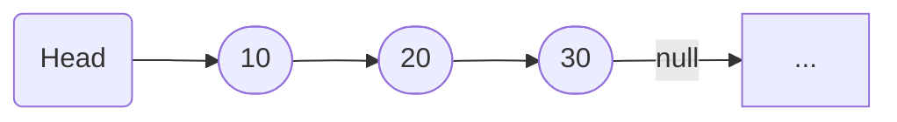

# Lista encadeada simples ##

```mermaid
graph LR
    Head(Head) --> A
    A([10])
    B([20])
    C([30])

    A --> B
    B --> C
    C -->|null| D[...]
```

---

## Lista duplamente encadeada ##

```mermaid
graph LR
    Head(Head) --> A
    Tail(Tail) --> C
    A([10])
    B([20])
    C([30])

    A --> B
    B --> C
    C -->|null| D[...]
    B --> A
    C --> B
```

---

## Lista encadeada circular ##

```mermaid
graph LR
    Head(Head) --> A
    A([10])
    B([20])
    C([30])

    A --> B
    B --> C
    C --> A
```

