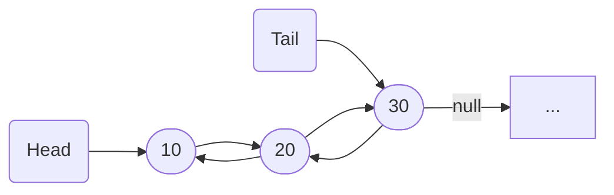
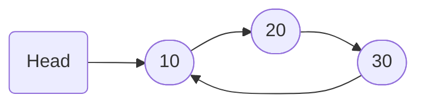

<!-- _class: lead -->

# Listas #

- Professor: Carlos Alvaro Quintella
- Revisão: 10/05/2023


---

Listas são uma estrutura de dados lineares que permite armazenar e manipular elementos de forma flexível e dinâmica.

Uma lista é uma coleção **ordenada ou não** de elementos, onde cada elemento contém uma referência para o próximo elemento na lista.

---

## Aplicações ##

- Implementação de Estruturas de Dados Complexas: As listas são frequentemente usadas como base para implementar outras estruturas de dados, como pilhas, filas, listas circulares e listas duplamente encadeadas. Essas estruturas de dados podem ser essenciais em muitos algoritmos e sistemas.

- Gerenciamento de Dados em Bancos de Dados: Em sistemas de gerenciamento de bancos de dados, as listas são usadas para representar registros ou tuplas de dados. Elas permitem armazenar e organizar dados de maneira flexível, permitindo a adição, remoção e modificação eficiente dos registros.

---

- Sistemas de Arquivos: As listas são úteis para o gerenciamento de arquivos em sistemas de armazenamento. Elas podem ser usadas para rastrear a estrutura de diretórios, a ordem dos arquivos e as permissões de acesso. Além disso, as listas podem ser usadas para implementar estruturas de alocação de espaço em disco.

- Ordenação de Dados: As listas são amplamente utilizadas em algoritmos de ordenação, como mergesort e heapsort. Esses algoritmos manipulam listas para reorganizar os elementos em uma ordem específica, como ordenação crescente ou decrescente.

---

- Representação de Grafos: Em teoria dos grafos, as listas de adjacência são frequentemente usadas para representar grafos. Cada vértice do grafo é associado a uma lista que armazena seus vizinhos ou arestas adjacentes. Isso permite uma representação eficiente de grafos com muitas conexões.

---

## Operações Básicas ##

As operações básicas realizadas em uma lista incluem:

- Inserir (insert): Adicionar um elemento em uma posição específica da lista.
- Remover (remove): Remover um elemento de uma posição específica da lista.

---

- Acessar (access): Acessar um elemento em uma posição específica da lista.
- Verificar se está vazia (is_empty): Verificar se a lista está vazia ou não.
- Tamanho (size): Obter o número de elementos na lista.
- Inserir em ordem: Inserir o elemento na posição correspondente montendo a ordem da lista.

---

Listas podem ser implementadas de várias maneiras, como listas encadeadas simples, listas duplamente encadeadas e listas circulares. A escolha da implementação depende das necessidades do problema e dos requisitos de desempenho.

---

# TAD: Lista #

```pseudocode

Tipo Lista
    Dados:
        - elementos: lista encadeada/array/duplamente encadeada
        - tamanho: inteiro
        
    Operações:
        - construtor(): inicializa a lista vazia
        - inserir(pos, x): insere o elemento x em uma posição específica da lista
        - remover(pos): remove o elemento em uma posição específica da lista
        - acessar(pos): retorna o elemento em uma posição específica da lista
        - esta_vazia(): retorna verdadeiro se a lista estiver vazia, falso caso contrário
        - obter_tamanho(): retorna o número de elementos na lista
```

---

As listas são amplamente utilizadas em várias aplicações e algoritmos. Elas oferecem flexibilidade para adicionar, remover e acessar elementos em posições arbitrárias, o que é útil em muitos cenários. Alguns exemplos de uso de listas incluem:

- Implementação de estruturas de dados mais complexas, como pilhas e filas.

---

- Gerenciamento de dados em bancos de dados e sistemas de gerenciamento de arquivos.
- Implementação de algoritmos de ordenação, como mergesort ou heapsort.
- Estruturas de dados para representar grafos, como listas de adjacência.

---


---

## Lista duplamente encadeada ##



---

## Lista encadeada circular ##



---

## Implementação ##

```cpp

struct Node {
    int data;        // Valor do nó
    Node* next;      // Ponteiro para o próximo nó
};
```

---

```cpp

class LinkedList {
private:
    Node* head;      // Ponteiro para o primeiro nó da lista

public:
    LinkedList() {
        head = nullptr;   // Inicializa a lista como vazia
    }

    // Método para inserir um elemento de forma ordenada na lista
    void insert(int value) {
        Node* newNode = new Node;
        newNode->data = value;
        newNode->next = nullptr;

        if (head == nullptr || value < head->data) {
            newNode->next = head;
            head = newNode;
        } else {
            Node* current = head;
            while (current->next != nullptr && current->next->data < value) {
                current = current->next;
            }
            newNode->next = current->next;
            current->next = newNode;
        }
    }

    // Outros métodos da lista encadeada (como remoção, busca, etc.)
};

```
