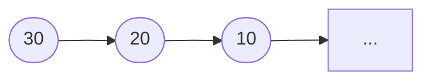

<!-- _class: lead -->

# Pilha #

- Professor: Carlos Alvaro Quintella
- Revisão: 10/05/2023


---

# Pilhas #

Pilha é uma estrutura de dados linear, comumente utilizada para organizar e manipular dados. Ela segue o protocolo **LIFO (Last In, First Out)**, o que significa que o último elemento inserido é o primeiro a ser removido.

- Como numa pilha de pratos, você coloca um por um, mas quando pega, pega sempre o de cima.


---

- As pilhas podem ser implementadas com vetores ou elementos da memória heap.

Quais as vantagens e desvantagens de cada uma?

* A escolha depende das necessidades do problema e dos requisitos de desempenho.

---

## Operações Básicas ##

As operações básicas realizadas em uma pilha incluem:

- Empilhar (push): Adicionar um elemento no topo da pilha.
- Desempilhar (pop): Remover o elemento do topo da pilha e retorná-lo.
- Ver topo (top): Acessar o elemento do topo da pilha sem removê-lo.
- Verificar se está vazia (is_empty): Verificar se a pilha está vazia ou não.
- Tamanho (size): Obter o número de elementos na pilha.

---

### TAD: Pilha ###

```pseudocode
Tipo Pilha
    Dados:
        - elementos: lista/array/lista encadeada
        - tamanho: inteiro
        
    Operações:
        - construtor(): inicializa a pilha vazia
        - empilhar(x): adiciona um elemento x no topo da pilha
        - desempilhar(): remove e retorna o elemento do topo da pilha
        - topo(): retorna o elemento do topo da pilha sem removê-lo
        - esta_vazia(): retorna verdadeiro se a pilha estiver vazia, falso caso contrário
        - obter_tamanho(): retorna o número de elementos na pilha
```

---

As pilhas são amplamente utilizadas em diversas situações do mundo real e em problemas de computação, tais como:

- Modelagem de chamadas de funções em tempo de execução.
- Gerenciamento de memória em sistemas operacionais.
- Avaliação de expressões aritméticas.
- Implementação de algoritmos como busca em profundidade.
- Implentação do UNDO ou desfazer em aplicações.

---

A estrutura LIFO das pilhas torna-as úteis para resolver problemas nos quais a ordem inversa de operações é relevante.

---

Implementação em C++ com vetor.

```cpp
class Stack {
private:
    int* data;  // Vetor para armazenar os elementos da pilha
    int capacity;  // Capacidade máxima da pilha
    int top;  // Índice do elemento no topo da pilha

public:
    // Construtor da pilha
    Stack(int size) {
        capacity = size;
        data = new int[capacity];
        top = -1;  // Inicializa o índice do topo como -1 (pilha vazia)
    }

    // Destrutor da pilha
    ~Stack() {
        delete[] data;
    }

```

---

```c
    // Verifica se a pilha está vazia
    bool isEmpty() {
        return (top == -1);
    }

    // Verifica se a pilha está cheia
    bool isFull() {
        return (top == capacity - 1);
    }

    // Insere um elemento no topo da pilha
    void push(int element) {
        if (isFull()) {
            cout << "Erro: a pilha está cheia." << endl;
        } else {
            top++;
            data[top] = element;
        }
    }
```

---

```c
    // Remove o elemento do topo da pilha e retorna seu valor
    int pop() {
        if (isEmpty()) {
            cout << "Erro: a pilha está vazia." << endl;
            return -1;  // Valor inválido para indicar um erro
        } else {
            int element = data[top];
            top--;
            return element;
        }
    }

    // Retorna o elemento no topo da pilha sem removê-lo
    int peek() {
        if (isEmpty()) {
            cout << "Erro: a pilha está vazia." << endl;
            return -1;  // Valor inválido para indicar um erro
        } else {
            return data[top];
        }
    }
};
````


---

## Implementação usando memória dinamica ##


---



---

Implementação em C++

```cpp
#include <iostream>

class Stack {
private:
    struct Node {
        int data;
        Node* next;
    };

    Node* topNode;   // Ponteiro para o nó do topo da pilha

public:
    Stack() {
        topNode = nullptr;   // Pilha vazia
    }

    ~Stack() {
        while (!isEmpty()) {
            pop();   // Desaloca todos os nós da pilha
        }
    }
```

---

```cpp

    void push(int value) {
        Node* newNode = new Node;
        newNode->data = value;
        newNode->next = topNode;
        topNode = newNode;
    }

    void pop() {
        if (isEmpty()) {
            std::cout << "A pilha está vazia. Não é possível remover elementos.\n";
            return;
        }

        Node* temp = topNode;
        topNode = topNode->next;
        delete temp;
    }
```

---

```c
    int top() {
        if (isEmpty()) {
            std::cout << "A pilha está vazia. Não há elementos no topo.\n";
            return -1;   // Valor inválido para indicar uma pilha vazia
        }

        return topNode->data;
    }

    bool isEmpty() {
        return topNode == nullptr;
    }
};

```

---

```cpp

int main() {
    Stack stack;

    // Inserção de elementos na pilha
    stack.push(10);
    stack.push(20);
    stack.push(30);
    stack.push(40);

    // Verificação do elemento do topo da pilha
    std::cout << "Elemento no topo da pilha: " << stack.top() << std::endl;

    // Remoção do elemento do topo da pilha
    stack.pop();

    // Verificação do novo elemento no topo da pilha
    std::cout << "Novo elemento no topo da pilha: " << stack.top() << std::endl;

    // Remoção do elemento do topo da pilha
    stack.pop();
```

---

```c
    // Verificação do novo elemento no topo da pilha
    std::cout << "Novo elemento no topo da pilha: " << stack.top() << std::endl;
    
    // Verificação se a pilha está vazia
    if (stack.isEmpty()) {
        std::cout << "A pilha está vazia." << std::endl;
    } else {
        std::cout << "A pilha não está vazia." << std::endl;
    }

    return 0;
}
```

---

Exercício:

Uma calculadora de RPN (Notação Polonesa Reversa) funciona seguindo os seguintes passos:

- Comece com uma pilha vazia.
- Leia a expressão da esquerda para a direita.
- Se o item atual for um número, empilhe-o na pilha.
- Se o item atual for um operador, retire os dois itens do topo da pilha, aplique o operador e empilhe o resultado.
- Continue até que toda a expressão seja lida.
- O resultado final da expressão será o único item restante na pilha.

---

```c
#include <iostream>
#include <sstream>

#define MAX_SIZE 100

bool isOperator(const std::string &token) {
    return token == "+" || token == "-" || token == "*" || token == "/";
}

double performOperation(const std::string &operation, double operand1, double operand2) {
    if (operation == "+") return operand1 + operand2;
    if (operation == "-") return operand1 - operand2;
    if (operation == "*") return operand1 * operand2;
    if (operation == "/") return operand1 / operand2;
    
    return 0;
}

double evaluateRPN(const std::string &expression) {
    double stack[MAX_SIZE];
    int stackTop = -1;
    std::stringstream tokens(expression);
    std::string token;
    
    while (std::getline(tokens, token, ' ')) {
        if (isOperator(token)) {
            double operand2 = stack[stackTop--];
            double operand1 = stack[stackTop--];
            
            stack[++stackTop] = performOperation(token, operand1, operand2);
        } else {
            stack[++stackTop] = std::stod(token);
        }
    }
    
    return stack[stackTop];
}

int main() {
    std::string expression = "5 3 4 + *";
    std::cout << "Resultado: " << evaluateRPN(expression) << std::endl;
    
    return 0;
}

```

---

1) Como funciona o princípio do "LIFO" (Last-In, First-Out) em uma pilha? Explique com um exemplo.

2) Quais são as duas operações básicas que podem ser realizadas em uma pilha?

3) Quais são os possíveis cenários de erro em uma pilha?

4) Qual é a diferença entre uma pilha estática e uma pilha dinâmica?
