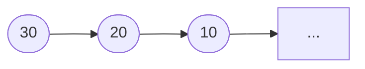

<!-- _class: lead -->

# Pilha #

- Professor: Carlos Alvaro Quintella
- Revisão: 10/05/2023


---

# Pilhas #

Pilhas são uma estrutura de dados linear comumente utilizada para organizar e manipular dados. Uma pilha segue o protocolo **LIFO (Last In, First Out)**, onde o último elemento inserido é o primeiro a ser removido.

---

## Operações Básicas ##

As operações básicas realizadas em uma pilha incluem:

- Empilhar (push): Adicionar um elemento no topo da pilha.
- Desempilhar (pop): Remover o elemento do topo da pilha e retorná-lo.
- Ver topo (top): Acessar o elemento do topo da pilha sem removê-lo.
- Verificar se está vazia (is_empty): Verificar se a pilha está vazia ou não.
- Tamanho (size): Obter o número de elementos na pilha.

---

As pilhas podem ser implementadas utilizando diferentes estruturas de dados subjacentes, como arrays ou listas encadeadas. A escolha da estrutura de dados depende das necessidades do problema e dos requisitos de desempenho.

---

TAD: Pilha

```pseudocode
Tipo Pilha
    Dados:
        - elementos: lista/array/lista encadeada
        - tamanho: inteiro
        
    Operações:
        - construtor(): inicializa a pilha vazia
        - empilhar(x): adiciona um elemento x no topo da pilha
        - desempilhar(): remove e retorna o elemento do topo da pilha
        - topo(): retorna o elemento do topo da pilha sem removê-lo
        - esta_vazia(): retorna verdadeiro se a pilha estiver vazia, falso caso contrário
        - obter_tamanho(): retorna o número de elementos na pilha
```

---

As pilhas são amplamente utilizadas em diversas situações do mundo real e em problemas de computação, tais como:

- Modelagem de chamadas de funções em tempo de execução.
- Gerenciamento de memória em sistemas operacionais.
- Avaliação de expressões aritméticas.
- Implementação de algoritmos como busca em profundidade.

A estrutura LIFO das pilhas torna-as úteis para resolver problemas nos quais a ordem inversa de operações é relevante.

---

## Implementação usando memória dinamica ##



---

```cpp
#include <iostream>

class Stack {
private:
    struct Node {
        int data;
        Node* next;
    };

    Node* topNode;   // Ponteiro para o nó do topo da pilha

public:
    Stack() {
        topNode = nullptr;   // Pilha vazia
    }

    ~Stack() {
        while (!isEmpty()) {
            pop();   // Desaloca todos os nós da pilha
        }
    }
```

---

```cpp

    void push(int value) {
        Node* newNode = new Node;
        newNode->data = value;
        newNode->next = topNode;
        topNode = newNode;
    }

    void pop() {
        if (isEmpty()) {
            std::cout << "A pilha está vazia. Não é possível remover elementos.\n";
            return;
        }

        Node* temp = topNode;
        topNode = topNode->next;
        delete temp;
    }

    int top() {
        if (isEmpty()) {
            std::cout << "A pilha está vazia. Não há elementos no topo.\n";
            return -1;   // Valor inválido para indicar uma pilha vazia
        }

        return topNode->data;
    }

    bool isEmpty() {
        return topNode == nullptr;
    }
};

```

---

```cpp

int main() {
    Stack stack;

    // Inserção de elementos na pilha
    stack.push(10);
    stack.push(20);
    stack.push(30);
    stack.push(40);

    // Verificação do elemento do topo da pilha
    std::cout << "Elemento no topo da pilha: " << stack.top() << std::endl;

    // Remoção do elemento do topo da pilha
    stack.pop();

    // Verificação do novo elemento no topo da pilha
    std::cout << "Novo elemento no topo da pilha: " << stack.top() << std::endl;

    // Remoção do elemento do topo da pilha
    stack.pop();

    // Verificação do novo elemento no topo da pilha
    std::cout << "Novo elemento no topo da pilha: " << stack.top() << std::endl;
    
    // Verificação se a pilha está vazia
    if (stack.isEmpty()) {
        std::cout << "A pilha está vazia." << std::endl;
    } else {
        std::cout << "A pilha não está vazia." << std::endl;
    }

    return 0;
}
```
