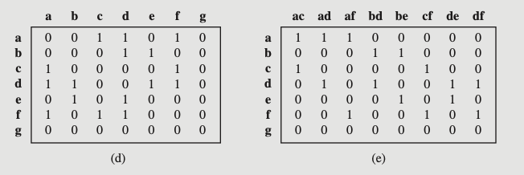

<!-- _class: lead -->

# Grafos - segunda parte #

- Professor: Carlos Alvaro Quintella
- Revisão: 10/05/2023

---

## Representação de Grafos ##

A representação adequada de um grafo depende do contexto em que ele é utilizado, seja na memória durante a execução de um programa ou quando armazenado em meio digital.

Existem diversas formas de representar um grafo, sendo as principais:

- Lista de Adjacência: Nessa representação, cada vértice do grafo possui uma lista que contém os vértices adjacentes a ele. Essa abordagem é eficiente para grafos esparsos, onde apenas as conexões relevantes são armazenadas.

---

- Matriz de Adjacência: Nessa representação, é utilizada uma matriz bidimensional em que as linhas e colunas representam os vértices do grafo. Os valores na matriz indicam a existência ou o peso das arestas entre os vértices. Essa representação é adequada para grafos densos.

---

Matriz de Adjacência.

|   | 1 | 2 | 3 | 4 | 5 |
|---|---|---|---|---|---|
| 1 | 0 | 1 | 0 | 1 | 0 |
| 2 | 1 | 0 | 1 | 0 | 0 |
| 3 | 0 | 1 | 0 | 1 | 1 |
| 4 | 1 | 0 | 1 | 0 | 0 |
| 5 | 0 | 0 | 1 | 0 | 0 |

coluna: origem, linha destino.

---

Matriz de Adjacência de uma matriz ponderada com 5 vértices.

|   | 1 | 2 | 3 | 4 | 5 |
|---|---|---|---|---|---|
| 1 | 0 | 5 | 0 | 3 | 0 |
| 2 | 2 | 0 | 3 | 0 | 0 |
| 3 | 0 | 1 | 0 | 5 | 2 |
| 4 | 3 | 0 | 8 | 0 | 0 |
| 5 | 0 | 0 | 1 | 0 | 0 |

coluna: origem, linha destino.

---

Lista de Adjacência como uma lista encadeada de vertices e adjacências.


---



---

- É importante considerar  como armazenar o grafo.
- Grafos direcionados possuem arestas com direção específica, enquanto grafos não direcionados não possuem essa distinção.
- Grafos ponderados precisam de pesos.

---

- Além disso, a escolha da forma de representação adequada deve levar em consideração o uso que será dado ao grafo pelo programa, tem que buscar a eficiência do armazenamento, na memória, aliados a velocidade de acesso aos elementos do grafo e a facilidade de sua manipulação.

- Lembre que as características específicas do grafo, como direção, ciclicidade e pesos, também influenciam na escolha da representação mais adequada.

---

### Matriz de Adjacência ###

É uma matriz quadrada de tamanho NxN, onde N é o número de vértices no grafo. A entrada M[i][j] é 1 se existe uma aresta entre o vértice "i" e o vértice "j", e 0 caso contrário. Para grafos não direcionados, a matriz é simétrica em relação à diagonal principal.

Exemplo para o grafo A - B - C - D:

```text
  A B C D
A 0 1 0 0
B 1 0 1 0
C 0 1 0 1
D 0 0 1 0
```

<!--Se o grafo for ponderado podemos usar os pesos no ligar do flag se existe link ou não.

Mas e se o grafo for direcionado? Se os pesos forem números naturais, que tal usa ro sinal para marcar a direção?

Mas e se for o caso onde possa haver mais de uma conexão em diferentes direçoes entre dois verties especificados? -->

---

### Matriz de Incidência ###

Uma matriz de incidência é uma matriz de tamanho NxM, onde N é o número de vértices e M é o número de arestas. A entrada M[i][j] é 1 se a aresta "j" é incidente ao vértice "i", e 0 caso contrário. Para um grafo não direcionado, cada coluna da matriz terá exatamente dois 1s.

Exemplo para o grafo A - B - C - D com as arestas AB, BC e CD:

---

### Lista de Adjacencia ###

Uma lista de adjacências é uma maneira de representar um grafo em que, para cada vértice do grafo, mantemos uma lista dos vértices aos quais ele está conectado por uma aresta. Essa representação é especialmente útil quando temos um grafo esparso (um grafo com poucas arestas em comparação ao número total possível de arestas), pois economiza espaço de armazenamento.

---

Por exemplo, para um grafo não direcionado com os vértices A, B, C, D e as arestas (A-B), (B-C), (C-D), a lista de adjacências seria a seguinte:

```text
A: B
B: A, C
C: B, D
D: C

```

---

Para representar um grafo com pesos e direcionado, você pode utilizar a representação de Lista de Adjacência com pesos nas arestas. Nesse formato, cada linha do arquivo representa um nó do grafo, e os nós adjacentes são listados com seus respectivos pesos.

```text
1: (2, 3.0), (3, 5.2)
2: (1, 2.1), (3, 4.4)
3: (1, 1.5), (2, 6.1)
```

---

---

Exemplo de implementação em C para matriz de adjacência:

```c

#include <stdio.h>

#define MAX_VERTICES 5
int visited[MAX_VERTICES];

void DFS(int graph[MAX_VERTICES][MAX_VERTICES], int start_vertex) {
    visited[start_vertex] = 1;
    printf("%d ", start_vertex);

    for (int i = 0; i < MAX_VERTICES; i++) {
        if (graph[start_vertex][i] == 1 && visited[i] == 0) {
            DFS(graph, i);
        }
    }
}

int main() {
    int graph[MAX_VERTICES][MAX_VERTICES] = {
        {0, 1, 0, 0, 1},
        {1, 0, 1, 1, 1},
        {0, 1, 0, 0, 0},
        {0, 1, 0, 0, 1},
        {1, 1, 0, 1, 0},
    };
  
    for (int i = 0; i < MAX_VERTICES; i++) {
        visited[i] = 0;
    }

    DFS(graph, 0);

    return 0;
}
```

---

## Exercício ##

Represente as pontes de Kronisberg como um grafo e em seguida com uma Lista de Adjacência.

[Mermaid editor](https://mermaid.live/)

---

Cada linha representa um vértice e os vértices aos quais ele está conectado. Por exemplo, o vértice B está conectado aos vértices A e C, portanto, a linha correspondente na lista de adjacências é "B: A, C".

Em uma lista de adjacências para um grafo direcionado, a presença de um vértice em outra lista de vértices significa que existe uma aresta na direção do primeiro vértice para o segundo.

---

## Travessia de Grafos ##

A travessia de grafos é uma maneira sistemática de visitar, ou "explorar", todos os vértices de um grafo. É uma tarefa fundamental para muitas aplicações, como busca na web, rastreamento de redes sociais, algoritmos de roteamento, etc.

---

O processo de travessia envolve "visitar" cada elemento do grafo.

> Isso é fácil de se fazer com uma lista encadeada,     onde cada elemento está conectado ao próximo em uma sequência linear. A travessia é direta, pois você pode começar em um ponto e seguir os links para cada próximo elemento.
> Já em grafos, por outro lado, não há uma sequência linear de elementos. Os elementos (ou "vértices") podem estar conectados de várias maneiras. Um vértice pode estar ligado a muitos outros, a nenhum, ou até mesmo a si mesmo. E também pode haver ciclos, onde você pode voltar a um vértice anterior. Portanto, a travessia de um grafo é muito mais complexa.

---

### Algoritmos para percorrer um grafo ###

Para percorrer um grafo nós podemos usar dois algoritmos conhecidos:

- [Depth-First Search](https://www.youtube.com/watch?v=PMMc4VsIacU) (DFS): Busca em Profundidade e (depth-first search) ou
- [Breadth-First Search](https://www.youtube.com/watch?v=xlVX7dXLS64) (BFS): Busca em Largura; que foi desenvolvido por John Hopcroft e Robert Tarjan.

---

### Depth-First Search ###

O DFS é um algoritmo que explora o grafo "profundamente" antes de "retroceder". Ou seja, ele segue um caminho o mais longe possível, e então, quando não há mais vértices a serem explorados nesse caminho, ele retorna ao último vértice com vértices adjacentes não explorados e prossegue a partir daí.

---

```c
void DFS(int vertex, int visited[], int adjacency_matrix[MAX_NODES][MAX_NODES]) {
    visited[vertex] = 1;
    printf("Visited %d\n", vertex);

    for(int i = 0; i < MAX_NODES; i++) {
        if(adjacency_matrix[vertex][i] == 1 && visited[i] == 0) {
            DFS(i, visited, adjacency_matrix);
        }
    }
}
```
---

### Breadth-First Search ###

O BFS é um algoritmo que explora o grafo "em largura". Isso significa que ele primeiro visita todos os vértices adjacentes ao vértice inicial, antes de passar para os vértices que estão a dois passos de distância, depois três passos, e assim por diante.

---

```c

void BFS(int adjacency_matrix[MAX_NODES][MAX_NODES], int start_node, int visited_nodes[MAX_NODES]) {
    int queue[MAX_NODES];
    int front = 0, rear = 0;

    queue[rear++] = start_node;
    visited_nodes[start_node] = 1;

    while (front != rear) {
        int current_node = queue[front++];
        printf("Visited node: %d\n", current_node);

        for (int i = 0; i < MAX_NODES; i++) {
            if (adjacency_matrix[current_node][i] == 1 && visited_nodes[i] == 0) {
                queue[rear++] = i;
                visited_nodes[i] = 1;
            }
        }
    }
}

```

---

## Busca de Menor Caminho ##

A busca pelo menor caminho em grafos é um problema fundamental em ciência da computação e teoria dos grafos.

- Consiste em encontrar a rota mais curta entre dois vértices em um grafo ponderado, onde os pesos representam as distâncias entre os vértices.

- Para resolver esse problema, o algoritmo de Dijkstra é uma das abordagens mais eficientes e amplamente utilizadas.

---

### algoritmo de Dijkstra ###

O algoritmo de Dijkstra funciona explorando iterativamente os vértices do grafo a partir do vértice de origem, calculando as distâncias mínimas até cada vértice visitado. Através de uma estrutura de dados chamada "fila de prioridade", o algoritmo seleciona o próximo vértice a ser visitado com base em suas distâncias mínimas conhecidas.

- Esse processo continua até que todos os vértices tenham sido visitados e as distâncias mínimas tenham sido calculadas.

---

O algoritmo de Dijkstra oferece uma solução eficiente para o problema do menor caminho em grafos, permitindo que rotas otimizadas sejam encontradas em uma variedade de aplicações, como sistemas de navegação, redes de transporte e otimização de rotas em geral.

[Dijkstra's Algorithm - Computerphile](https://www.youtube.com/watch?v=GazC3A4OQTE)
[How Dijkstra's Algorithm Works](https://www.youtube.com/watch?v=EFg3u_E6eHU)

---

## Propriedades de Grafos ##

Várias propriedades de grafos que podem ser computadas e analisadas, muitas sobre tudo com ampla utilização na área das  redes complexas. Aqui estão algumas das propriedades comumente estudadas:

- Grau (Degree): O **grau de um nó** em uma rede é o número de conexões que ele possui. O **grau do grafo** todo é o maior grau entre todos os vértices do grafo. Em outras palavras, é o maior número de arestas conectadas a qualquer vértice no grafo.

---

- Tamanho (Size): o tamanho do grafo é a soma do número de vértices com o número de arestas.

- Distribuição de Grau (Degree Distribution): A distribuição de grau é a probabilidade de um nó na rede ter um determinado grau. Ela descreve como os graus dos nós estão distribuídos na rede.

- Coeficiente de Aglomeração (Clustering Coefficient): O coeficiente de aglomeração mede a tendência dos vizinhos de um nó estarem conectados entre si.

---

- Caminhos Mínimos (Shortest Paths): Os caminhos mínimos são os caminhos mais curtos entre dois nós em uma rede. A análise dos caminhos mínimos pode fornecer informações sobre a eficiência da comunicação ou a propagação de informações na rede.

- Centralidade (Centrality): A centralidade é uma medida que identifica os nós mais importantes ou influentes em uma rede. Existem diferentes tipos de centralidade, como a centralidade de grau, a centralidade de proximidade, a centralidade de intermediação (betweenness) e a centralidade de vetor próprio (eigenvector centrality).

---

- Coesão da Comunidade (Community Cohesion): A coesão da comunidade é uma medida da força dos agrupamentos ou comunidades na rede. Ela indica o quão fortemente os nós de uma comunidade estão conectados entre si em comparação com as conexões fora da comunidade.

- Componentes Conectados (Connected Components): Os componentes conectados são conjuntos de nós que estão interconectados, onde é possível percorrer de qualquer nó para qualquer outro nó dentro do componente. A análise dos componentes conectados pode revelar a estrutura geral da rede e a existência de sub-redes isoladas.

---

- Centralidade de Intermediação (Betweenness Centrality): A centralidade de intermediação mede a importância de um nó na comunicação entre outros nós na rede. Um nó com alta centralidade de intermediação atua como um ponto de passagem crítico ao longo dos caminhos mais curtos entre outros nós.
