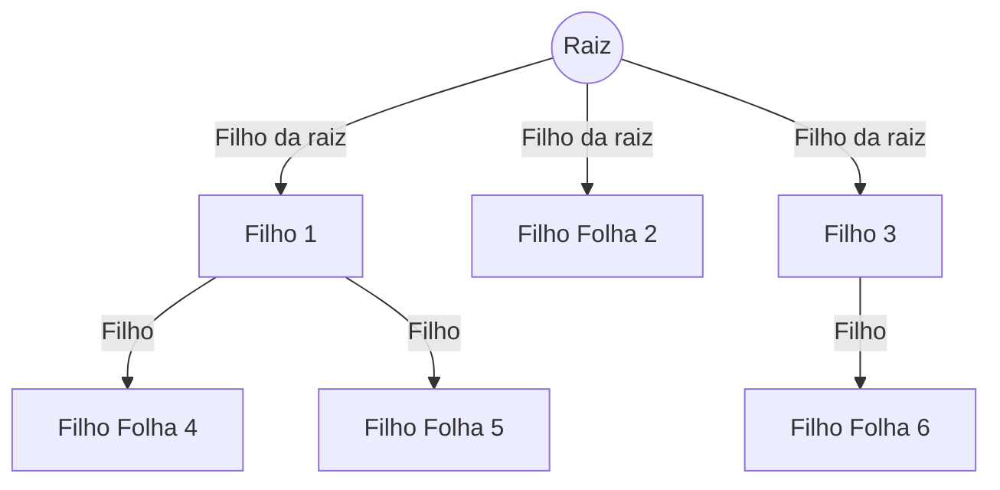
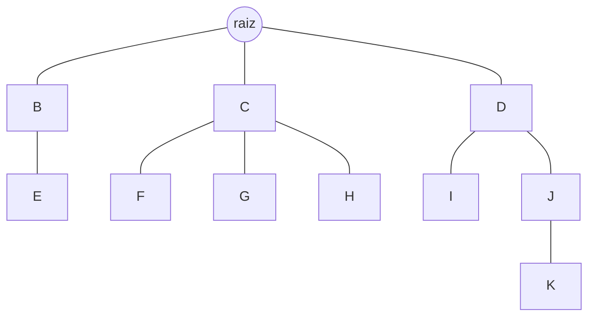

<!-- _class: lead -->

# Árvores #

- Professor: Carlos Alvaro Quintella
- Revisão: 10/05/2023


---

As árvores são uma categoria importante de estruturas de dados não lineares. Elas são usadas para representar hierarquias e relacionamentos entre elementos, bem como para realizar operações de busca, inserção e remoção de maneira eficiente.

- [Wikipedia](https://pt.wikipedia.org/wiki/%C3%81rvore_(estrutura_de_dados))


---

A origem das árvores como estruturas de dados remonta às primeiras pesquisas em ciência da computação e matemática. Os primeiros trabalhos em estruturas de dados baseadas em árvores foram desenvolvidos na década de 1950 e 1960, com o objetivo de organizar e gerenciar informações de maneira eficiente e hierárquica.

---

## Aplicações ##

Árvores são usadas em muitas aplicações, incluindo sistemas de arquivos, bancos de dados, algoritmos de busca e compressão de dados, Jogos, Computação gráfica, Navegação, GUI e outros.


---

- Árvore de Decisão
- Árvore de Diretório
- Outras


---

## Vantagens de se usar árvores ##

- As árvores refletem as relações estruturais nos dados.
- são usada para representar hierarquias.
Fornecem operações eficientes de inserção e busca.
As árvores são flexíveis. Permitem mover subárvores com mínimo esforço.

---

## Exemplo de uma estrutura de árvore ##



[mermaid.live](https://mermaid.live)

---

## Definições ##

- Uma estrutura de dados vazia, é uma **árvore vazia**.

- **Raíz**: A raiz é o primeiro nó da árvore e não possui nenhum nó pai. Todos os outros nós da árvore são descendentes diretos ou indiretos da raiz.

- **Floresta**: Uma floresta é um conjunto de árvores que não estão conectadas entre si. Cada árvore individual em uma floresta é chamada de componente.

- **Nó**: Um nó é um elemento individual da árvore que contém informações (dados) e pode ter referências para seus nós filhos.

---

- **Arestas**: Faz a conexão entre os nós.

- **Pai**: O pai é o nó que está diretamente conectado a outro nó por uma aresta em direção à raiz. Cada nó, exceto a raiz, tem exatamente um nó pai.

- **Filho**: Um filho é um nó que está diretamente conectado a outro nó por uma aresta na direção oposta à raiz. Um nó pode ter zero ou mais nós filhos.

- **Folha**: Um nó folha é um nó que não possui filhos. As folhas são os nós terminais da árvore.

---


---

- **Árvore Ordenada**: Uma árvore ordenada é aquela na qual os filhos de cada nó estão ordenados.
  - Assume-se ordenação da esquerda para a direita.

- **Árvore Cheia**: Uma árvore de grau `d` é uma árvore cheia se possui o número máximo de nós, isto é, todos os nós tem número máximo de filhos (exceto as folhas, logicamente) e o das as folhas estão na mesma altura.

- **Árvores com grau 2**: Cada nó pode ter 2 filhos, no máximo.

---

- **Caminho**: Cada nó deve ser alcançável a partir da raiz através de uma sequência única de arcos, chamada caminho. O número de árcos no caminho é o **comprimento** do caminho.

- **Árvore Equilibrada**: Uma árvore equilibrada é uma árvore em que a diferença de alturas entre as subárvores de qualquer nó na árvore é no máximo um. Em outras palavras, para cada nó na árvore, a altura da subárvore esquerda e a altura da subárvore direita diferem no máximo em uma unidade.

---

## Métricas de Árvores ##

As métricas em árvores são usadas para avaliar e descrever suas propriedades e características. Algumas métricas comuns em árvores incluem:

- **Altura da árvore**: É a distância entre a raíz e seu nó mais profundo.

- Se T é uma árvore, h(T) é dito: a altura de T.

- Se V é uma subárvore, h(V) é a altura da Subárvore.

---

- **Profundidade de um nó**: A profundidade de um nó é o número de arestas entre a raiz e o nó. A profundidade da raiz é 0, e a profundidade dos outros nós é a profundidade do nó pai mais 1.


---

- **Altura de um nó**.


---

- **Tamanho**:  O tamanho de uma árvore é o número total de nós presentes nela.

- **Grau**: O grau de um nó é o número máximo de filhos que ele possui. O grau de uma árvore é equivalente ao Grau do nó com maior quantidade de filhos.

- **Caminho**: Um caminho em uma árvore é uma sequência de nós conectados por arestas. O comprimento de um caminho é o número de arestas nele.

---

Essas métricas podem ser usadas para analisar o desempenho e a eficiência de algoritmos de árvore e para otimizar a estrutura da árvore para melhor atender aos requisitos de uma aplicação específica.


---

## Perguntas ##

* Quais são algumas das principais aplicações das estruturas de dados de árvore?
* Como a estrutura de uma árvore reflete as relações estruturais nos dados?
* O que é um nó em uma estrutura de árvore e qual é a sua função?

---

* O que é o grau de um nó e como ele se relaciona com a estrutura geral da árvore?
* Como as métricas de árvore, como altura, profundidade e tamanho, podem ser usadas para otimizar a estrutura da árvore para uma aplicação específica?

---

## Árvore é um tipo especial de grafo ##

Um grafo é composto por vértices (ou nós) e arestas que conectam esses nós.

A árvore é um tipo de grafo, mas com algumas propriedades específicas que a distinguem de outros tipos de grafos:

- **Conectividade**: Em uma árvore, todos os nós estão conectados por exatamente um caminho. Isso significa que você pode ir de qualquer nó a qualquer outro nó seguindo uma sequência de arestas, e há apenas uma maneira de fazer isso.

---

- **Ausência de ciclos**: Uma árvore é um grafo acíclico, o que significa que não há ciclos. Um ciclo ocorre quando você pode começar em um nó, seguir uma sequência de arestas e voltar ao nó de partida sem repetir nenhuma aresta.

- **Raiz**: Uma árvore tem um nó especial chamado raiz. A raiz é o único nó que não tem um nó pai. Todos os outros nós da árvore são descendentes da raiz.

- **Hierarquia**: As árvores têm uma estrutura hierárquica natural. Cada nó na árvore (exceto a raiz) tem exatamente um nó pai e zero ou mais nós filhos.

---

Portanto, embora todas as árvores sejam grafos, nem todos os grafos são árvores. As árvores são um subconjunto de grafos que satisfazem as propriedades acima.

---

## Tipos de árvores ##

Uma das primeiras árvores de dados conhecidas é a árvore binária, que foi introduzida por John von Neumann em 1946 para resolver problemas de pesquisa, classificação e codificação de prefixo. Desde então, muitas outras árvores e variações foram propostas e desenvolvidas para resolver uma ampla gama de problemas de computação.

- A principal utilização de árvores binárias são as árvores binárias de busca

---

- As árvores representam hierarquias, facilitando pesquisas e organizar dados de maneira eficiente e eficaz.

**Árvore Binária**: É uma árvore onde cada nó tem no máximo dois filhos, geralmente chamados de filho esquerdo e filho direito.

**Árvore Binária de Busca** (Binary Search Tree, BST): É uma árvore binária com a propriedade de que o valor de cada nó é maior do que ou igual a todos os valores dos nós à sua esquerda e menor do que ou igual a todos os valores dos nós à sua direita. As BSTs permitem inserção, remoção e pesquisa eficientes.

---

**Árvore AVL**: É uma árvore binária de busca autoequilibrada que garante que a altura da árvore permaneça logarítmica em relação ao número de nós. As árvores AVL realizam rotações para manter o equilíbrio após inserções e remoções.

---

**Árvore B**: É uma árvore de busca generalizada que permite que cada nó tenha um número variável de filhos (maior que 2) e chaves. As árvores B são comumente usadas em sistemas de gerenciamento de banco de dados e sistemas de arquivos (como o NTFS) para armazenar e recuperar dados de maneira eficiente.

A estrutura das Árvores B é otimizada para minimizar o número de acessos a disco ou outras operações de entrada e saída, tornando-as ideais para sistemas que precisam lidar com grandes volumes de dados persistentes.

---

**Árvore B+** é uma variação da Árvore B que foi projetada especificamente para otimizar a recuperação de dados em sistemas de armazenamento em disco.

---

**Árvore de Segmentos (Segment Tree)**: É uma árvore binária usada para armazenar informações sobre intervalos ou segmentos. As árvores de segmentos são úteis para resolver problemas que envolvem consultas e atualizações de intervalos em um array.

**Árvore Fenwick (ou Binary Indexed Tree, BIT)**: É uma estrutura de dados que combina as propriedades de arrays e árvores binárias para fornecer uma maneira eficiente de executar consultas de intervalo e atualizações em arrays.

---

**Árvore K-D (K-Dimensional Tree)**: É uma árvore binária de busca que armazena pontos em um espaço k-dimensional. As árvores K-D são usadas para pesquisas espaciais eficientes, como consultas de vizinhos mais próximos.

---

## Representação ##

Podemos representar uma árvore tanto com vetores quanto com memória dinâmica.

- No caso de vetores usamos  um vetor de uma estrutura de dados composta com o dado e um vetor com um ponteiro inteiro para o índice da posição do vetor. Os links para os filhos deve ser provisionado com o valor máximo de links possível.

---

```c
#define M 5 // Define o número máximo de filhos

typedef struct Node {
    int n; // de filhos do nó
    int data;
    int children[M]; // Vetor de ponteiros para os filhos
} Node_t;
```

---

- No caso de memória dinâmica usamos uma estrutura com ponteiros para os filhos.

```c
#define M 5 // Define o número máximo de filhos

typedef struct Node {
    int n; // de filhos do nó
    int data;
    struct Node * childre[M]; // Vetor de ponteiros para os filhos
} Node_t;
```

---

## Percurso de uma árvore ##

Assim como percorremos um vetor ou uma matriz para recuperar ou imprimir seu conteúdo, podemos fazer o mesmo com árvores. No entanto, observe que as árvores, assim como as matrizes, podem ser percorridas de diferentes maneiras.

_Nota_:Percorrer uma árvore significa visitar (exibir o conteúdo ou executar uma operação) cada nó da árvore de maneira sistemática e ordenada.

---

## Percurso/Travessia de Árvores ##

Existem várias formas de percorrer uma árvore, e as mais comuns são os percursos em profundidade e em largura. Nos percursos em profundidade, temos três métodos principais:

1. **Pré-ordem (Preorder)**: Neste método, a árvore é percorrida na seguinte ordem: primeiro, visita-se a raiz, depois percorre-se a subárvore esquerda e, por fim, a subárvore direita.

---

2. **Em ordem (Inorder)**: Neste método, a árvore é percorrida na seguinte ordem: primeiro, visita-se a subárvore esquerda, depois a raiz e, por fim, a subárvore direita. Para árvores binárias de busca, esse percurso retorna os valores em ordem crescente.

3. **Pós-ordem (Postorder)**: Neste método, a árvore é percorrida na seguinte ordem: primeiro, visita-se a subárvore esquerda, depois a subárvore direita e, por fim, a raiz.

---

No percurso em largura, também chamado de **travessia em nível (Level-order traversal)**, os nós são visitados nível por nível, da esquerda para a direita. Esse percurso pode ser realizado usando uma fila para armazenar os nós a serem visitados em cada nível.

[4 ways to traverse binary trees](https://dev.to/abdisalan_js/4-ways-to-traverse-binary-trees-with-animations-5bi5)

---

## Resumo das Métricas de árvores ##

- Altura da árvore: É a distância entre a raíz e seu nó mais profundo.
- Profundidade de um nó: A profundidade de um nó é o número de arestas entre a raiz e o nó. A profundidade da raiz é 0, e a profundidade dos outros nós é a profundidade do nó pai mais 1.

- Altura de um nó: A altura de um nó é a distância do nó até o nó mais profundo em sua subárvore.

- Tamanho da árvore: O tamanho de uma árvore é o número total de nós presentes nela.

---

- Grau de um nó: O grau de um nó é o número de filhos que ele possui. O grau de uma árvore é o grau do nó que tem o maior número de filhos.

- Caminho: Um caminho em uma árvore é uma sequência de nós conectados por arestas. O comprimento de um caminho é o número de arestas nele.

---

## Perguntas 2 ##

1. Qual é a ordem de percurso de uma árvore no método Pré-ordem?
   - A) Subárvore esquerda, raiz, subárvore direita
   - B) Raiz, subárvore esquerda, subárvore direita
   - C) Subárvore esquerda, subárvore direita, raiz
   - D) Raiz, subárvore direita, subárvore esquerda

---

2. No percurso Em ordem de uma árvore binária de busca, em que ordem os valores são retornados?
   - A) Decrescente
   - B) Aleatória
   - C) Crescente
   - D) Não há ordem específica

---

3. Qual é a ordem de percurso de uma árvore no método Pós-ordem?
   - A) Raiz, subárvore esquerda, subárvore direita
   - B) Subárvore esquerda, raiz, subárvore direita
   - C) Subárvore esquerda, subárvore direita, raiz
   - D) Raiz, subárvore direita, subárvore esquerda

---

4. No percurso em largura ou travessia em nível, como os nós são visitados?
   - A) Nível por nível, da direita para a esquerda
   - B) Nível por nível, da esquerda para a direita
   - C) Da raiz para as folhas, da esquerda para a direita
   - D) Da raiz para as folhas, da direita para a esquerda

---

Qual a profundidade e o tamanho da árvore?

A apresente a ordem dos nós em percurso de pré-ordem.



[mermaid.live](https://mermaid.live)

---

Uma árvore binária pode ser implementada usando um vetor (ou array) de uma maneira muito eficiente. A ideia é representar a árvore como um array de tal forma que para qualquer nó em um índice `i`, seus filhos esquerdo e direito estão nos índices `2*i+1` e `2*i+2`, respectivamente, e seu pai está no índice `(i-1)/2` (para i>0).

---

1. **Inserção**: Para inserir um novo nó na árvore, você simplesmente adiciona o novo valor ao final do array. Isso garante que a árvore permaneça completa (ou seja, todos os níveis da árvore, exceto possivelmente o último, estão totalmente preenchidos).

2. **Acesso**: Para acessar um nó ou seus filhos e pai, você pode usar as fórmulas de índice mencionadas acima. Por exemplo, se você quiser acessar o filho esquerdo de um nó em um índice `i`, você simplesmente acessa o elemento no índice `2*i+1` no array.

---

3. **Remoção**: A remoção de um nó é mais complicada. Uma maneira de fazer isso é substituir o nó que você deseja remover pelo último nó no array e, em seguida, remover o último nó. No entanto, isso pode violar a propriedade de ordenação da árvore (se for uma árvore binária de busca), então você precisaria reordenar a árvore depois.

4. **Busca**: Para buscar um valor na árvore, você precisaria percorrer o array. No pior caso, isso leva tempo linear, mas se a árvore for uma árvore binária de busca, você pode usar a propriedade de ordenação para acelerar a busca para o tempo logarítmico.

---

Essa implementação é muito eficiente em termos de memória, pois não requer ponteiros extras para cada nó. No entanto, ela tem algumas limitações. Por exemplo, ela só funciona bem para árvores binárias completas, e as operações de inserção e remoção podem ser lentas se a árvore for grande e precisar ser reordenada frequentemente.

---

## Links ##

[data structures reference](https://www.interviewcake.com/data-structures-reference)

---