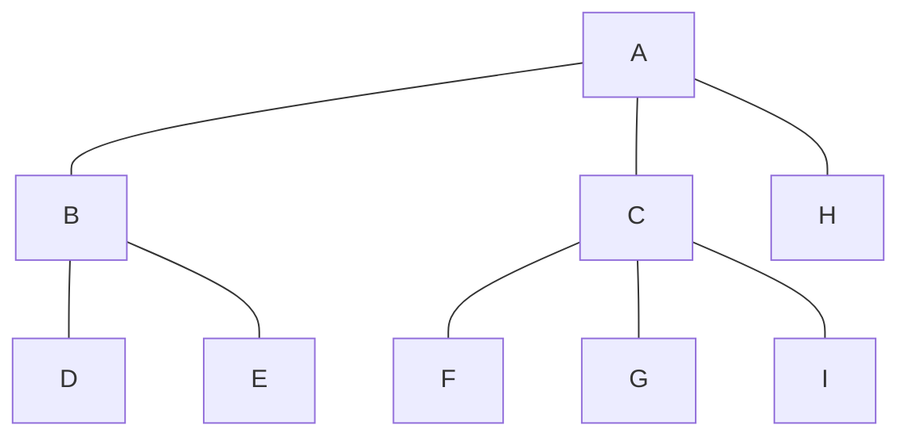
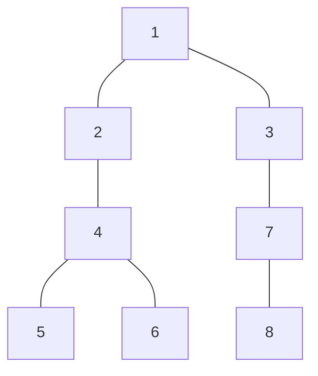
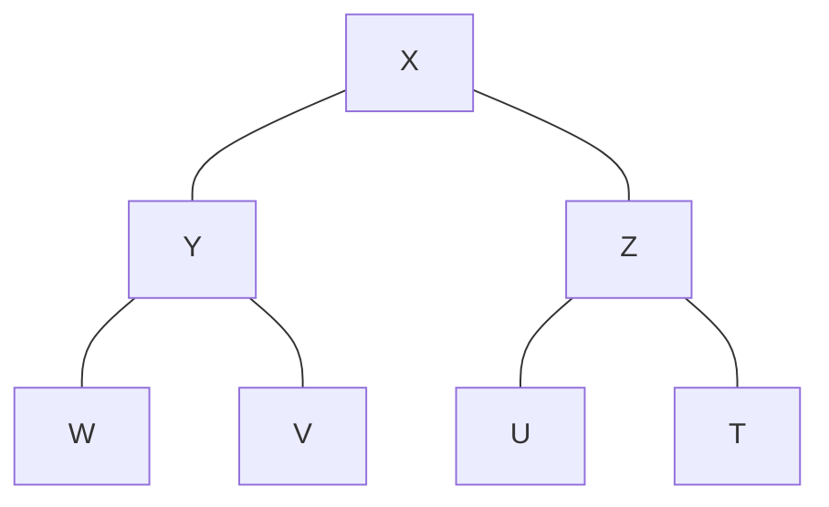
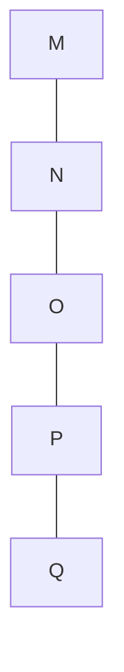
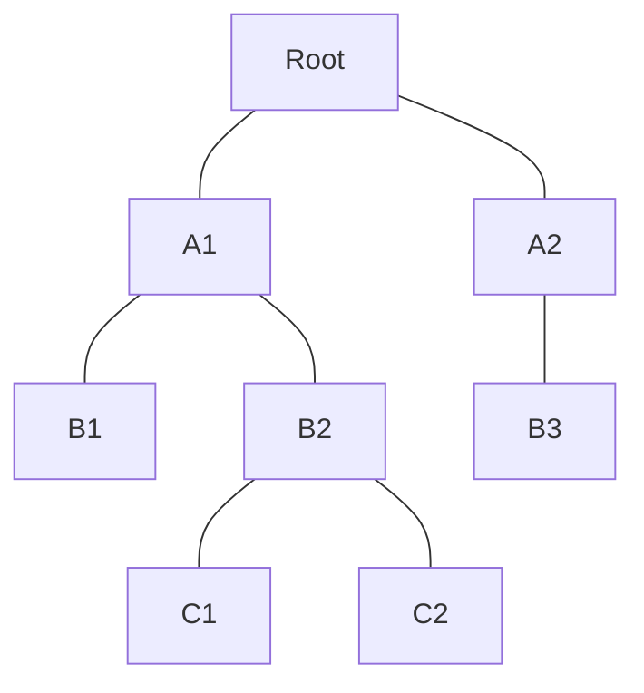

t---
marp: true
author: carlos.quintella@uva.br
backgroundColor: white
paginate: true
footer: Estruturas de Dados
theme: gaia
---

# Árvores Binárias #

As árvores binárias são estruturas de dados amplamente utilizadas na ciência da computação. Existem diferentes tipos de árvores binárias, cada uma com suas características específicas e aplicações adequadas.

---

## Importância das árvores binárias na ciência da computação ##

- Buscas eficientes: árvores binárias de busca
- Organização de dados em sistemas de arquivos
- Representação de expressões [matemáticas](https://en.wikipedia.org/wiki/Binary_expression_tree)
- Jogos

---

Um exemplo interessante da aplicação de árvores binárias em jogos é para mapear o universo de jogadas de uma partida de jogo da velha por exemplo. Cada nó da árvore representaria um estado do tabuleiro e pode ser usado para mapear qual seria o melhor próximo movimento a ser feito.

---

## Alguns tipos de Árvores Binárias ##

- Árvores Binárias de Busca
- Árvores AVL
- Árvores Rubro-Negras
- outras.

---

### árvore Binária Completa ###

Uma árvore binária completa é um tipo especial de árvore binária que possui duas propriedades distintas:

1. **Todos os níveis da árvore, exceto possivelmente o último (o mais profundo), estão completamente preenchidos.** Isso significa que cada nó nesses níveis tem dois filhos (esquerdo e direito).

2. **No último nível da árvore, todos os nós estão o mais à esquerda possível.** Isso significa que se o último nível não estiver completamente preenchido, então todos os nós que estão presentes nesse nível devem estar alinhados à esquerda, sem espaços vazios entre eles.

---

A ideia por trás de uma árvore binária completa é que ela é uma árvore "perfeitamente balanceada". Cada nível da árvore tem o máximo de nós que pode ter, dado que é uma árvore binária (ou seja, cada nó tem no máximo dois filhos). Isso torna a árvore muito eficiente em termos de utilização de espaço e pode também melhorar a eficiência de certas operações de árvore.

**NOTA**: a principio nao existe limite para a altura de uma arvore, depende apenas da disponibilidade de memória.

---

## Árvores Binárias de Busca ##

_Também conhecidas como árvores binárias ordenadas._

Uma árvore binária de busca tem a seguinte propriedade: para cada nó _n_ da árvore, todos os valores armazenados em sua subárvore esquerda (a árvore cuja raiz é o filho esquerdo) são menores do que o valor _v_ armazenado em _n_, e todos os valores armazenados na subárvore direita são maiores ou iguais a _v_.

**Nota:** Armazenar várias cópias do mesmo valor na mesma árvore pode levar a problemas de ambiguidade e tornar a estrutura de dados menos eficiente.

---

Em uma árvore de busca binária, cada nó é geralmente usado para armazenar um valor exclusivo, e a estrutura da árvore é construída de tal forma que cada valor é armazenado em um único nó. Se múltiplas cópias do mesmo valor são armazenadas na árvore, pode se tornar difícil determinar a localização exata de cada cópia e qual delas é a correta. Isso pode levar a erros na busca e manipulação dos dados armazenados na árvore.

Além disso, armazenar múltiplas cópias do mesmo valor em uma árvore pode torná-la menos eficiente, já que é necessário alocar mais espaço para armazenar os valores repetidos e executar mais operações de busca e comparação para lidar com esses valores.

---

### Implementação de Árvore Binária de Busca ###

As árvores binárias de busca podem ser implementadas de pelo menos duas maneiras: como arrays e como estruturas interconectadas (linked structures).

---

#### Implementação com Array ###

Para implementar uma árvore como um array, um nó é declarado como uma estrutura com um campo de informação e dois campos de "ponteiro". Esses campos de ponteiro contêm os índices das células do array em que os filhos esquerdo e direito são armazenados, se houver algum.

```cpp
struct Node {
    int data;
    int left_child;
    int right_child;
};
```

---

Como se trata de um array, o ponteiro é `int`, pois é o índice do array.

A raiz é sempre localizada na primeira célula, célula 0, e -1 indica um filho nulo.

---

Embora possa precer prática, essa implementação pode ser inconveniente, mesmo que se use um array dinâmico como o `<vector>` do C++.

- As localizações dos filhos devem ser conhecidas para inserir um novo nó e essas localizações podem precisar ser localizadas sequencialmente.
- Outra inconveniência, é que depois de excluir um nó da árvore, um buraco no array teria que ser eliminado.
- Isso pode ser feito usando um marcador especial para uma célula não utilizada, o que pode levar a popular o array com muitas células não utilizadas, ou movendo os elementos uma posição, o que também requer atualizar as referências aos elementos que foram movidos.
Às vezes, uma implementação de array é conveniente mas geralmente, outra abordagem precisa ser usada.

---

## Implementação com memória dinâmica ##

Vamos implementar uma árvore binária baseada no TAD abaixo.

```text
TAD Árvore Binária
------------------

Atributos:
- Esquerda: Ponteiro para o nó filho esquerdo
- Direita: Ponteiro para o nó filho direito
- Valor: Valor armazenado no nó

```

---

(continuação)

```text
Métodos:
- CriarÁrvore(valor)
- Inserir(raiz, valor)
- Remover(raiz, valor)
- Buscar(raiz, valor)
- MenorValor(raiz)
- PercursoPréOrdem(raiz)
- PercursoEmOrdem(raiz)
- PercursoPósOrdem(raiz)

Operações adicionais:
- ContarElementos(raiz): Retorna o número de elementos na árvore
- CalcularAltura(raiz): Retorna a altura da árvore
```

---

### Operações em Árvores Binárias de Busca ###

- Inserção de um nó
- Remoção de um nó
- Busca de um nó
- Verificação da existência de um nó.
- Contar o tamanho e a profundidade da árvore.

---

#### Inserção de um nó ####

A inserção de um nó em uma árvore binária de busca envolve comparar o valor a ser inserido com o valor do nó atual. Se o valor for menor, ele é inserido na subárvore esquerda; se for maior, é inserido na subárvore direita. Esse processo é realizado recursivamente até encontrar uma posição adequada para a inserção.

---

#### Remoção de um nó ####

A remoção de um nó em uma árvore binária de busca requer a identificação do nó a ser removido. Se o nó for uma folha, ele pode ser removido diretamente. Caso contrário, se tiver apenas um filho, o filho substituirá o nó a ser removido. Se o nó tiver dois filhos, é necessário encontrar o sucessor ou predecessor mais próximo para substituí-lo. Em seguida, é feita a remoção do sucessor ou predecessor.

---

#### Busca de um nó ####

A busca de um nó em uma árvore binária de busca começa pela raiz. Se o valor procurado for igual ao valor do nó atual, o nó é encontrado. Caso contrário, se o valor for menor, a busca continua na subárvore esquerda. Se for maior, a busca continua na subárvore direita. Esse processo é realizado recursivamente até encontrar o nó desejado ou até chegar a uma folha.

---

#### Verificação da existência de um nó ####

A verificação da existência de um nó em uma árvore binária de busca segue o mesmo processo de busca descrito anteriormente. Se o nó for encontrado, retorna-se verdadeiro; caso contrário, retorna-se falso.

#### Contar o tamanho e a profundidade da árvore ####

O tamanho da árvore pode ser contado utilizando um percurso em ordem (inorder traversal) e mantendo um contador para cada nó visitado. A profundidade da árvore pode ser obtida utilizando uma função recursiva que percorre a árvore e calcula a altura máxima da subárvore esquerda e da subárvore direita, retornando a maior altura entre as duas e incrementando uma unidade para representar a altura da raiz.

---

### Travessia da Ávore Binária de Busca ###

A travessia de uma árvore binária de busca é o processo de visitar todos os nós da árvore em uma determinada ordem. Existem três principais tipos de travessia em uma árvore binária de busca: ordem, pré-ordem e pós-ordem. Cada tipo de travessia segue uma sequência específica de visitas aos nós.

---

#### Recursividade ####

As árvores binárias são frequentemente abordadas por meio de recursividade, o que provê uma resolução simples e eficiente de problemas utilizando o método divisão para conquistar.

---

#### Diferentes Modos de Travessia da árvore Binária ###

1. Ordem (in-order): Na travessia em ordem, os nós são visitados seguindo a seguinte sequência:

- Visitar o nó filho esquerdo.
- Visitar o nó atual.
- Visitar o nó filho direito.

Essa sequência resulta na visita dos nós em ordem crescente das chaves, ou seja, os nós são visitados em uma sequência que reflete a ordenação dos elementos da árvore. Portanto, na travessia em ordem de uma árvore binária de busca, os elementos são visitados em ordem crescente.

---

- **A travessia em ordem é útil para**: **obter os elementos da árvore em ordem crescente**, realizar operações que requerem uma visita sequencial dos elementos, como a criação de uma lista ordenada, e para validar se a estrutura da árvore está correta.

---

2. Pré-ordem (pre-order):Na travessia pré-ordem, os nós são visitados seguindo a seguinte sequência:

- Visitar o nó atual.
- Visitar o nó filho esquerdo.
- Visitar o nó filho direito.

Essa sequência resulta na visita dos nós na ordem em que eles aparecem à medida que a travessia percorre a árvore. Na travessia pré-ordem, o nó atual é visitado antes de seus filhos.

---

- **A travessia pré-ordem é útil para**: **criar uma cópia da árvore, realizar operações que requerem uma visita sequencial dos elementos** em uma ordem específica e para percorrer a árvore de forma a obter uma pré-ordem específica.

---

3. Pós-ordem (post-order):
Na travessia pós-ordem, os nós são visitados seguindo a seguinte sequência:

- Visitar o nó filho esquerdo.
- Visitar o nó filho direito.
- Visitar o nó atual.

Essa sequência resulta na visita dos nós na ordem em que eles aparecem à medida que a travessia percorre a árvore, mas o nó atual é visitado por último.

---

- **A travessia pós-ordem é útil para**: **liberar a memória ocupada pela árvore**, realizar operações que requerem uma visita sequencial dos elementos em uma ordem específica (por exemplo, ao **calcular a expressão de uma árvore de expressão aritmética**) e para percorrer a árvore de forma a obter uma pós-ordem específica.

---

**Em resumo**, a travessia de uma árvore binária de busca em ordem visita os nós em ordem crescente, a travessia pré-ordem visita o nó atual antes de seus filhos e a travessia pós-ordem visita os filhos antes de visitar o nó atual. 

- **IMPORTANTE**: Cada tipo de travessia tem suas aplicações específicas e pode ser escolhido de acordo com os requisitos do problema em questão.

---

## Desenhos de árvores válidas ##









---

## Implementação de Árvores Binárias de Busca com Vetores ##

Ao implementar uma árvore binária usando um vetor (ou array), algumas propriedades especiais devem ser consideradas para garantir a correta estruturação e acesso aos elementos da árvore. Aqui estão algumas dessas propriedades:

1. **Acesso aos filhos e ao pai**: Para um nó no índice `i` do vetor, seus filhos estão localizados nos índices `2*i+1` (filho esquerdo) e `2*i+2` (filho direito). O pai de um nó no índice `i` está no índice `(i-1)/2` (para `i > 0`). Essas fórmulas permitem navegar pela árvore de forma eficiente usando apenas índices e cálculos simples.

---

2. **Estrutura completa**: Ao usar um vetor para representar uma árvore binária, é importante garantir que o vetor tenha espaço suficiente para alocar todos os nós da árvore. Para isso, geralmente é necessário alocar um vetor com um tamanho que seja uma potência de 2, pois as árvores binárias completas têm um número específico de nós em cada nível.

3. **Ordem dos nós no vetor**: A ordem dos nós no vetor segue um padrão específico. Normalmente, os nós são armazenados no vetor em ordem de percurso em largura (BFS), de cima para baixo e da esquerda para a direita. Isso significa que a raiz da árvore é armazenada no índice 0 do vetor, seu filho esquerdo no índice 1, seu filho direito no índice 2 e assim por diante.

---

4. **Elemento sentinela**: É comum usar um elemento sentinela, como um valor nulo, para indicar nós ausentes no vetor. Isso é especialmente útil quando a árvore não é completa e alguns nós estão ausentes em determinadas posições. O elemento sentinela permite diferenciar nós presentes de nós ausentes no vetor.

5. **Operações de inserção e remoção**: As operações de inserção e remoção em uma árvore binária implementada com vetor podem ser um pouco mais complexas do que em uma estrutura de dados dinâmica. Para inserir um novo nó, é necessário encontrar a posição correta no vetor, respeitando a ordem dos elementos. Para remover um nó, é preciso reorganizar os elementos no vetor para manter a estrutura da árvore.

---

6. **Eficiência espacial**: Uma das principais vantagens de implementar uma árvore binária usando vetor é a eficiência espacial. Como não são necessários ponteiros adicionais para cada nó, a estrutura de dados ocupa menos espaço na memória em comparação com a implementação baseada em ponteiros.

---

No entanto, é importante mencionar que a implementação de uma árvore binária usando vetor tem algumas limitações. Por exemplo, se a árvore não for completa, pode haver desperdício de espaço no vetor. Além disso, as operações de inserção e remoção podem exigir reorganizações frequentes dos elementos no vetor, o que pode ter um custo computacional maior em comparação com estruturas de dados dinâmicas.

---

Código para implementação em C.

```cpp

#include <iostream>
#include <vector>

using namespace std;

struct Node {
    int data;
    int left_child;
    int right_child;
};

class BinaryTree {
public:
    BinaryTree() {
        // Inicializa o vetor com um nó raiz nulo
        nodes.push_back({0, -1, -1});
    }

    // Insere um novo nó na árvore com o valor especificado
    void insert(int value) {
        int current = 0; // Começa na raiz

        // Percorre a árvore até encontrar uma folha vazia para inserir o novo nó
        while (true) {
            if (value < nodes[current].data) {
                if (nodes[current].left_child == -1) {
                    nodes.push_back({value, -1, -1});
                    nodes[current].left_child = nodes.size() - 1;
                    break;
                } else {
                    current = nodes[current].left_child;
                }
            } else {
                if (nodes[current].right_child == -1) {
                    nodes.push_back({value, -1, -1});
                    nodes[current].right_child = nodes.size() - 1;
                    break;
                } else {
                    current = nodes[current].right_child;
                }
            }
        }
    }

    // Busca um valor na árvore
    bool search(int value) {
        int current = 0; // Começa na raiz

        while (current != -1) {
            if (nodes[current].data == value) {
                return true; // Valor encontrado
            } else if (value < nodes[current].data) {
                current = nodes[current].left_child;
            } else {
                current = nodes[current].right_child;
            }
        }

        return false; // Valor não encontrado
    }

private:
    vector<Node> nodes;
};

int main() {
    BinaryTree tree;

    tree.insert(5);
    tree.insert(2);
    tree.insert(7);
    tree.insert(1);
    tree.insert(3);

    cout << tree.search(3) << endl; // Saída: 1 (true)
    cout << tree.search(6) << endl; // Saída: 0 (false)

    return 0;
}
```

---

## Mais sobre a travessia em árvores ##

A travessia de árvores binárias e árvores m-vias (ou árvores m-árias) envolve percorrer os nós da árvore seguindo uma ordem específica. 

No entanto, existem diferenças importantes entre as duas estruturas de árvore em termos de como a travessia é realizada. Vamos explorar essas diferenças:

---

Travessia em Árvores Binárias:

As árvores binárias são aquelas em que cada nó possui no máximo dois filhos: um filho esquerdo e um filho direito.

As principais formas de travessia em árvores binárias são: pré-ordem, em ordem e pós-ordem.

Na travessia pré-ordem (ou pré-fixada), a ordem de visita dos nós é: raiz, subárvore esquerda, subárvore direita.

Na travessia em ordem (ou infixa), a ordem de visita dos nós é: subárvore esquerda, raiz, subárvore direita. Para árvores binárias de busca, essa travessia retorna os valores em ordem crescente.

Na travessia pós-ordem (ou pós-fixada), a ordem de visita dos nós é: subárvore esquerda, subárvore direita, raiz.

Essas formas de travessia são aplicáveis apenas a árvores binárias, pois a estrutura da árvore é restrita a dois filhos por nó.

---

Travessia em Árvores m-vias:

As árvores m-vias (ou árvores m-árias) são aquelas em que cada nó pode ter até m filhos, onde m é um número inteiro maior ou igual a 2.

A travessia em árvores m-vias também pode ser realizada em diferentes ordens, mas a forma mais comum é a travessia em pré-ordem.

Na travessia em pré-ordem de árvores m-vias, a ordem de visita dos nós é: raiz, filho 1, filho 2, ..., filho m.

Após visitar o primeiro filho, a travessia continua em profundidade para esse filho e seus descendentes antes de prosseguir para o próximo filho.

Essa abordagem de travessia em pré-ordem é aplicada a todas as subárvores de cada filho de um nó, permitindo explorar todos os nós da árvore.

Ao contrário das árvores binárias, nas árvores m-vias não há uma ordem natural entre os filhos de um nó, e cada filho pode ter um número diferente de descendentes.

---

Em resumo, a principal diferença entre a travessia de árvores binárias e árvores m-vias está na estrutura da árvore e na ordem em que os nós são visitados. Nas árvores binárias, a travessia ocorre em três formas (pré-ordem, em ordem e pós-ordem), enquanto nas árvores m-vias, a travessia mais comum é em pré-ordem, percorrendo todos os filhos de um nó antes de prosseguir para o próximo filho.

---

Além das formas de travessia mencionadas anteriormente, tanto em árvores binárias quanto em árvores m-vias, também é possível aplicar os conceitos de travessia em largura (BFS - Breadth-First Search) e travessia em profundidade (DFS - Depth-First Search) utilizados em grafos. Vamos explorar essas abordagens:

---

Travessia em Largura (BFS):

A travessia em largura é uma técnica que explora os nós da árvore ou do grafo em níveis ou camadas, visitando todos os nós de um mesmo nível antes de prosseguir para o próximo nível.

Na travessia em largura, utilizamos uma fila para armazenar os nós a serem visitados.

O processo começa com a raiz (ou nó inicial) sendo inserida na fila.

 Em cada iteração, o nó da frente da fila é removido e visitado. Em seguida, seus filhos (ou nós adjacentes, no caso de grafos) são inseridos na fila.

Esse processo continua até que a fila esteja vazia, o que indica que todos os nós foram visitados.

---

Travessia em Profundidade (DFS):

A travessia em profundidade é uma técnica que explora os nós da árvore ou do grafo mergulhando o máximo possível em um ramo antes de retroceder.

Na travessia em profundidade, utilizamos uma pilha (ou recursão) para armazenar os nós a serem visitados.

O processo começa com a raiz (ou nó inicial) sendo inserida na pilha.

Em cada iteração, o nó do topo da pilha é removido e visitado. Em seguida, seus filhos (ou nós adjacentes, no caso de grafos) são inseridos na pilha.

Esse processo continua até que a pilha esteja vazia, o que indica que todos os nós foram visitados.

---

Tanto a travessia em largura quanto a travessia em profundidade podem ser aplicadas tanto em árvores binárias quanto em árvores m-vias. A escolha entre essas abordagens depende do contexto e dos requisitos específicos do problema em questão. A travessia em largura é útil para explorar a estrutura em níveis, enquanto a travessia em profundidade é eficaz para explorar ramos completos da árvore ou do grafo.

É importante ressaltar que, embora a travessia em largura e em profundidade sejam comumente aplicadas a grafos, essas técnicas também podem ser adaptadas para explorar árvores, considerando as propriedades estruturais específicas de cada tipo de árvore.
