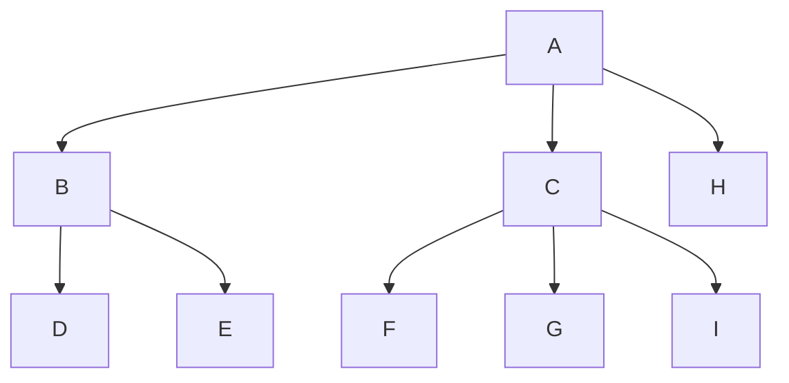
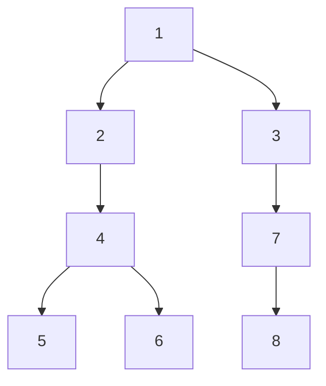
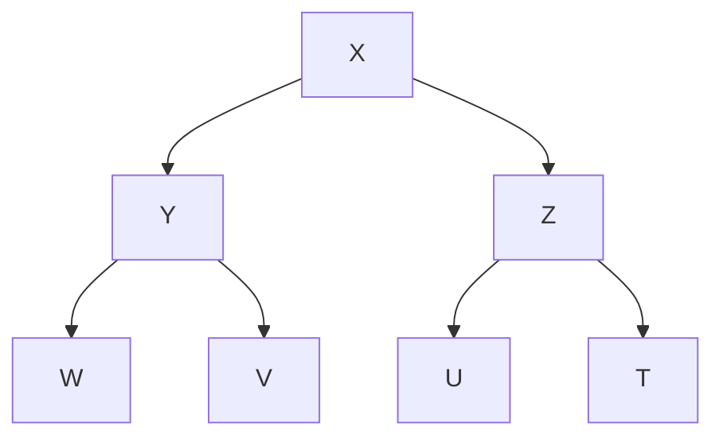
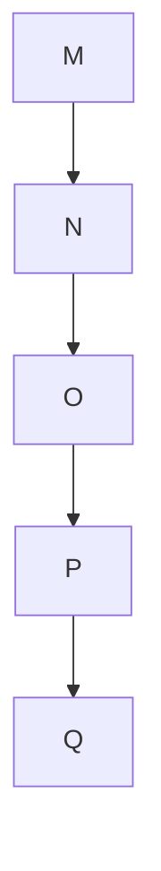
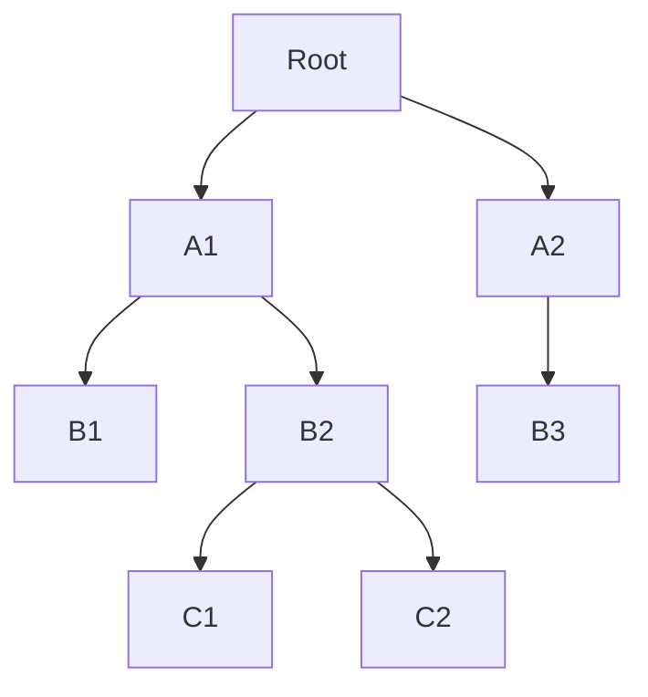

# Árvores Binárias #

As árvores binárias são estruturas de dados amplamente utilizadas na ciência da computação. Existem diferentes tipos de árvores binárias, cada uma com suas características específicas e aplicações adequadas.

- Árvores Binárias de Busca
- Árvores AVL
- Árvores Rubro-Negras
- outras.

---

## Árvores binárias de busca ##

Também conhecidas como árvores binárias ordenadas. É um caso

Uma árvore de busca binária tem a seguinte propriedade: para cada nó n da árvore, todos os valores armazenados em sua subárvore esquerda (a árvore cuja raiz é o filho esquerdo) são menores do que o valor v armazenado em n, e todos os valores armazenados na subárvore direita são maiores ou iguais a v.

Armazenar várias cópias do mesmo valor na mesma árvore pode levar a problemas de ambiguidade e tornar a estrutura de dados menos eficiente.

---

Em uma árvore de busca binária, cada nó é geralmente usado para armazenar um valor exclusivo, e a estrutura da árvore é construída de tal forma que cada valor é armazenado em um único nó. Se múltiplas cópias do mesmo valor são armazenadas na árvore, pode se tornar difícil determinar a localização exata de cada cópia e qual delas é a correta. Isso pode levar a erros na busca e manipulação dos dados armazenados na árvore.

Além disso, armazenar múltiplas cópias do mesmo valor em uma árvore pode torná-la menos eficiente, já que é necessário alocar mais espaço para armazenar os valores repetidos e executar mais operações de busca e comparação para lidar com esses valores.

---

### Implementação de Árvore Binária de Busca ###

As árvores binárias de busca podem ser implementadas de pelo menos duas maneiras: como arrays e como estruturas interconectadas (linked structures).

---

#### Implementação com Array ###

Para implementar uma árvore como um array, um nó é declarado como uma estrutura com um campo de informação e dois campos de "ponteiro". Esses campos de ponteiro contêm os índices das células do array em que os filhos esquerdo e direito são armazenados, se houver algum.

```cpp
struct Node {
    int data;
    int left_child;
    int right_child;
};
````

Como se trata de um array, o ponteiro é int, pois é o índice do array.

A raiz é sempre localizada na primeira célula, célula 0, e -1 indica um filho nulo.

---

Embora possa precer prática, essa implementação pode ser inconveniente, mesmo que se use um array dinâmico como o `<vector>` do C++.

- As localizações dos filhos devem ser conhecidas para inserir um novo nó e essas localizações podem precisar ser localizadas sequencialmente.
- Outra inconveniência, é que depois de excluir um nó da árvore, um buraco no array teria que ser eliminado.
- Isso pode ser feito usando um marcador especial para uma célula não utilizada, o que pode levar a popular o array com muitas células não utilizadas, ou movendo os elementos uma posição, o que também requer atualizar as referências aos elementos que foram movidos.
Às vezes, uma implementação de array é conveniente mas geralmente, outra abordagem precisa ser usada.

---

## Implementação com memória dinâmica ##

---

## Travessia da ávore binária de busca ##

A travessia de uma árvore binária de busca é o processo de visitar todos os nós da árvore em uma determinada ordem. Existem três principais tipos de travessia em uma árvore binária de busca: ordem, pré-ordem e pós-ordem. Cada tipo de travessia segue uma sequência específica de visitas aos nós.

1. Ordem (in-order):
Na travessia em ordem, os nós são visitados seguindo a seguinte sequência:
- Visitar o nó filho esquerdo.
- Visitar o nó atual.
- Visitar o nó filho direito.

Essa sequência resulta na visita dos nós em ordem crescente das chaves, ou seja, os nós são visitados em uma sequência que reflete a ordenação dos elementos da árvore. Portanto, na travessia em ordem de uma árvore binária de busca, os elementos são visitados em ordem crescente.

A travessia em ordem é útil para obter os elementos da árvore em ordem crescente, realizar operações que requerem uma visita sequencial dos elementos, como a criação de uma lista ordenada, e para validar se a estrutura da árvore está correta.

2. Pré-ordem (pre-order):
Na travessia pré-ordem, os nós são visitados seguindo a seguinte sequência:
- Visitar o nó atual.
- Visitar o nó filho esquerdo.
- Visitar o nó filho direito.

Essa sequência resulta na visita dos nós na ordem em que eles aparecem à medida que a travessia percorre a árvore. Na travessia pré-ordem, o nó atual é visitado antes de seus filhos.

A travessia pré-ordem é útil para criar uma cópia da árvore, realizar operações que requerem uma visita sequencial dos elementos em uma ordem específica e para percorrer a árvore de forma a obter uma pré-ordem específica.

3. Pós-ordem (post-order):
Na travessia pós-ordem, os nós são visitados seguindo a seguinte sequência:
- Visitar o nó filho esquerdo.
- Visitar o nó filho direito.
- Visitar o nó atual.

Essa sequência resulta na visita dos nós na ordem em que eles aparecem à medida que a travessia percorre a árvore, mas o nó atual é visitado por último.

A travessia pós-ordem é útil para liberar a memória ocupada pela árvore, realizar operações que requerem uma visita sequencial dos elementos em uma ordem específica (por exemplo, ao calcular a expressão de uma árvore de expressão aritmética) e para percorrer a árvore de forma a obter uma pós-ordem específica.

Em resumo, a travessia de uma árvore binária de busca em ordem visita os nós em ordem crescente, a travessia pré-ordem visita o nó atual antes de seus filhos e a travessia pós-ordem visita os filhos antes de visitar o nó atual. Cada tipo de travessia tem suas aplicações específicas e pode ser escolhido de acordo com os requisitos do problema em questão.

---

## Busca em árvore binária ## 

A busca em uma árvore binária é um procedimento que permite encontrar um elemento específico na estrutura da árvore. Ela envolve percorrer os nós da árvore de forma organizada, comparando o elemento buscado com as chaves presentes nos nós, até que o elemento desejado seja encontrado ou seja determinado que ele não está presente na árvore.

Existem diferentes abordagens para realizar a busca em uma árvore binária. Duas das principais são a busca em ordem (in-order traversal) e a busca em profundidade (depth-first search).

1. Busca em Ordem (In-order traversal): Nessa abordagem, a árvore é percorrida seguindo uma ordem específica, visitando primeiro o nó filho esquerdo, depois o nó atual e, por fim, o nó filho direito. Durante o percurso, é feita uma comparação entre a chave do nó atual e o elemento buscado. Se forem iguais, o elemento é encontrado. Caso contrário, a busca continua pelo nó filho esquerdo se o elemento buscado for menor que a chave do nó atual, ou pelo nó filho direito se for maior. Esse processo é repetido até que o elemento seja encontrado ou até que seja determinado que ele não está presente na árvore.

2. Busca em Profundidade (Depth-First Search): Nessa abordagem, a árvore é percorrida de forma recursiva ou utilizando uma pilha. Começando pela raiz, é feita uma comparação entre o elemento buscado e a chave do nó atual. Se forem iguais, o elemento é encontrado. Caso contrário, a busca continua de forma recursiva pelo nó filho esquerdo se o elemento buscado for menor que a chave do nó atual, ou pelo nó filho direito se for maior. Esse processo é repetido até que o elemento seja encontrado ou até que seja determinado que ele não está presente na árvore.

Independentemente da abordagem escolhida, a busca em uma árvore binária é eficiente, pois a estrutura da árvore permite eliminar uma parte significativa dos nós a cada comparação realizada, reduzindo o número de nós visitados.

É importante ressaltar que a eficiência da busca depende do balanceamento da árvore. Em árvores binárias balanceadas, como as árvores binárias de busca balanceadas (AVL trees) ou as árvores rubro-negras (red-black trees), o tempo de busca é proporcional à altura da árvore, resultando em uma busca com complexidade O(log n), onde n é o número de nós da árvore. Por outro lado, em árvores binárias não balanceadas, a altura pode ser proporcional ao número de nós, resultando em uma busca com complexidade O(n), onde n é o número de nós da árvore.

### raiz ###

root level 1


### nós ###

Em uma árvore, um nó não-terminal (também chamado de nó interno) é um nó que tem pelo menos um filho. Em outras palavras, um nó não-terminal é um nó que não é uma folha, ou seja, está localizado em algum lugar entre a raiz e as folhas da árvore.

---


### folha ###

Em uma árvore, uma "folha" (também chamada de "nó folha" ou "nó terminal") é um nó que não tem nenhum filho. Em outras palavras, uma folha é um nó que está localizado na extremidade de um ramo e não tem nenhum outro nó conectado a ele.


---

### Altura da árvore ###

The empty tree is a legitimate tree of height 0 (by definition), and a single node is a tree of height 1

node and arches 


a principio nao existe limite para a altura de uma arvore, depende apenas da disponibilidade de memoria

Compare busca e insercao em arvore e lista ligada

An important characteristic of bi- nary trees, which is used later in assessing an expected efficiency of sorting algo- rithms, is the number of leaves.

As already defined, the level of a node is the number of arcs traversed from the root to the node plus one.

## Desenhos de árvores válidas ##









---

## Binary search tree with arrays ##

```cpp

#include <iostream>
#include <vector>

using namespace std;

struct Node {
    int data;
    int left_child;
    int right_child;
};

class BinaryTree {
public:
    BinaryTree() {
        // Inicializa o vetor com um nó raiz nulo
        nodes.push_back({0, -1, -1});
    }

    // Insere um novo nó na árvore com o valor especificado
    void insert(int value) {
        int current = 0; // Começa na raiz

        // Percorre a árvore até encontrar uma folha vazia para inserir o novo nó
        while (true) {
            if (value < nodes[current].data) {
                if (nodes[current].left_child == -1) {
                    nodes.push_back({value, -1, -1});
                    nodes[current].left_child = nodes.size() - 1;
                    break;
                } else {
                    current = nodes[current].left_child;
                }
            } else {
                if (nodes[current].right_child == -1) {
                    nodes.push_back({value, -1, -1});
                    nodes[current].right_child = nodes.size() - 1;
                    break;
                } else {
                    current = nodes[current].right_child;
                }
            }
        }
    }

    // Busca um valor na árvore
    bool search(int value) {
        int current = 0; // Começa na raiz

        while (current != -1) {
            if (nodes[current].data == value) {
                return true; // Valor encontrado
            } else if (value < nodes[current].data) {
                current = nodes[current].left_child;
            } else {
                current = nodes[current].right_child;
            }
        }

        return false; // Valor não encontrado
    }

private:
    vector<Node> nodes;
};

int main() {
    BinaryTree tree;

    tree.insert(5);
    tree.insert(2);
    tree.insert(7);
    tree.insert(1);
    tree.insert(3);

    cout << tree.search(3) << endl; // Saída: 1 (true)
    cout << tree.search(6) << endl; // Saída: 0 (false)

    return 0;
}

```
