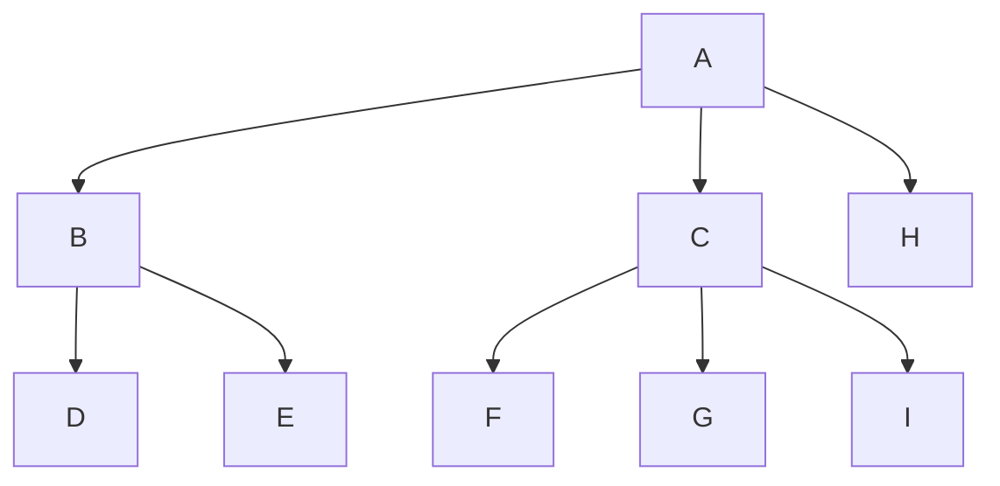
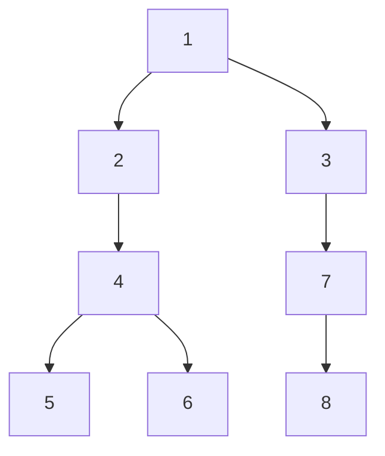
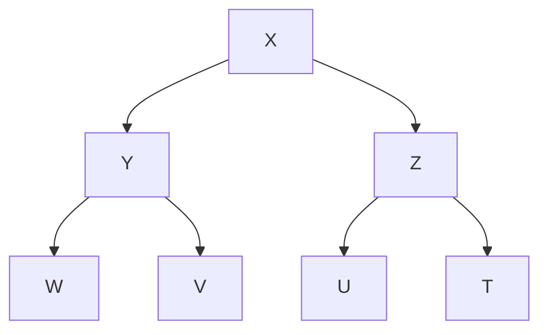
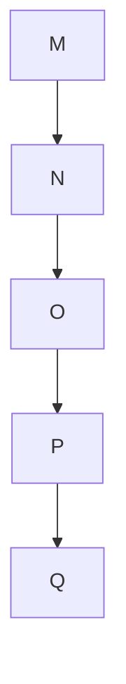
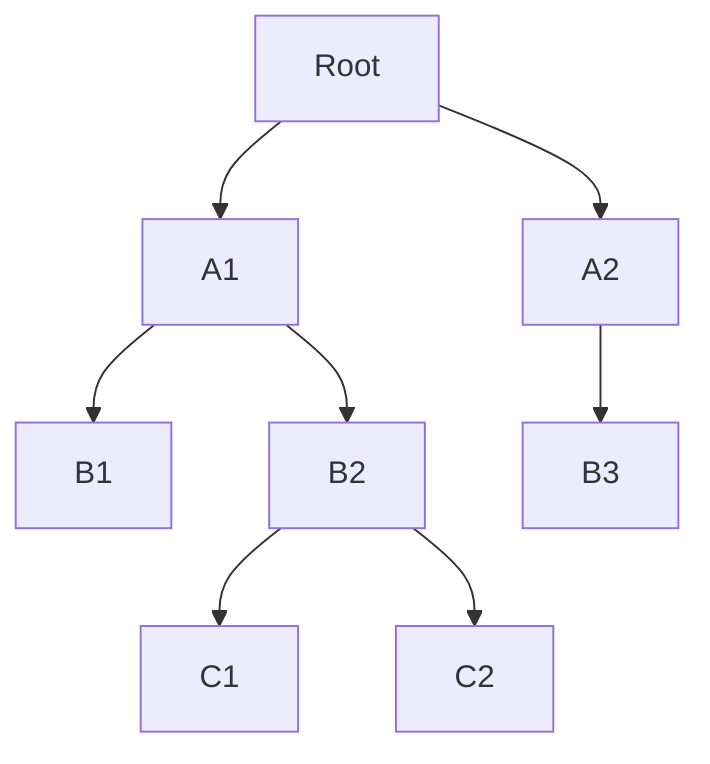

---

## Binary search trees, also called ordered binary trees ##

Uma árvore de busca binária tem a seguinte propriedade: para cada nó n da árvore, todos os valores armazenados em sua subárvore esquerda (a árvore cuja raiz é o filho esquerdo) são menores do que o valor v armazenado em n, e todos os valores armazenados na subárvore direita são maiores ou iguais a v.

Armazenar várias cópias do mesmo valor na mesma árvore pode levar a problemas de ambiguidade e tornar a estrutura de dados menos eficiente.

---

Em uma árvore de busca binária, cada nó é geralmente usado para armazenar um valor exclusivo, e a estrutura da árvore é construída de tal forma que cada valor é armazenado em um único nó. Se múltiplas cópias do mesmo valor são armazenadas na árvore, pode se tornar difícil determinar a localização exata de cada cópia e qual delas é a correta. Isso pode levar a erros na busca e manipulação dos dados armazenados na árvore.

Além disso, armazenar múltiplas cópias do mesmo valor em uma árvore pode torná-la menos eficiente, já que é necessário alocar mais espaço para armazenar os valores repetidos e executar mais operações de busca e comparação para lidar com esses valores.

---

### Implementação de Binary Search Tree ###

As árvores binárias podem ser implementadas de pelo menos duas maneiras: como arrays e como estruturas interconectadas (linked structures).

---

#### com vetor ###

Para implementar uma árvore como um array, um nó é declarado como uma estrutura com um campo de informação e dois campos de "ponteiro". Esses campos de ponteiro contêm os índices das células do array em que os filhos esquerdo e direito são armazenados, se houver algum. 

```cpp
struct Node {
    int data;
    int left_child;
    int right_child;
};
````

---

No entanto, essa implementação pode ser inconveniente, mesmo que o array seja flexível - ou seja, um vetor. As localizações dos filhos devem ser conhecidas para inserir um novo nó e essas localizações podem precisar ser localizadas sequencialmente. Depois de excluir um nó da árvore, um buraco no array teria que ser eliminado. Isso pode ser feito usando um marcador especial para uma célula não utilizada, o que pode levar a popular o array com muitas células não utilizadas, ou movendo os elementos uma posição, o que também requer atualizar as referências aos elementos que foram movidos. Às vezes, uma implementação de array é conveniente e desejável, e será usada ao discutir o heap sort. Mas geralmente, outra abordagem precisa ser usada.

---

A raiz é sempre localizada na primeira célula, célula 0, e -1 indica um filho nulo. Nessa representação, os dois filhos do nó 13 estão localizados nas posições 4 e 2, e o filho direito do nó 31 é nulo.

---

### raiz ###

root level 1


### nós ###

Em uma árvore, um nó não-terminal (também chamado de nó interno) é um nó que tem pelo menos um filho. Em outras palavras, um nó não-terminal é um nó que não é uma folha, ou seja, está localizado em algum lugar entre a raiz e as folhas da árvore.

---


### folha ###

Em uma árvore, uma "folha" (também chamada de "nó folha" ou "nó terminal") é um nó que não tem nenhum filho. Em outras palavras, uma folha é um nó que está localizado na extremidade de um ramo e não tem nenhum outro nó conectado a ele.


---

### Altura da árvore ###

The empty tree is a legitimate tree of height 0 (by definition), and a single node is a tree of height 1

node and arches 


a principio nao existe limite para a altura de uma arvore, depende apenas da disponibilidade de memoria

Compare busca e insercao em arvore e lista ligada

An important characteristic of bi- nary trees, which is used later in assessing an expected efficiency of sorting algo- rithms, is the number of leaves.

As already defined, the level of a node is the number of arcs traversed from the root to the node plus one.

## Desenhos de árvores válidas ##








```mermaid

```

---

## Binary search tree with arrays ##

```cpp

#include <iostream>
#include <vector>

using namespace std;

struct Node {
    int data;
    int left_child;
    int right_child;
};

class BinaryTree {
public:
    BinaryTree() {
        // Inicializa o vetor com um nó raiz nulo
        nodes.push_back({0, -1, -1});
    }

    // Insere um novo nó na árvore com o valor especificado
    void insert(int value) {
        int current = 0; // Começa na raiz

        // Percorre a árvore até encontrar uma folha vazia para inserir o novo nó
        while (true) {
            if (value < nodes[current].data) {
                if (nodes[current].left_child == -1) {
                    nodes.push_back({value, -1, -1});
                    nodes[current].left_child = nodes.size() - 1;
                    break;
                } else {
                    current = nodes[current].left_child;
                }
            } else {
                if (nodes[current].right_child == -1) {
                    nodes.push_back({value, -1, -1});
                    nodes[current].right_child = nodes.size() - 1;
                    break;
                } else {
                    current = nodes[current].right_child;
                }
            }
        }
    }

    // Busca um valor na árvore
    bool search(int value) {
        int current = 0; // Começa na raiz

        while (current != -1) {
            if (nodes[current].data == value) {
                return true; // Valor encontrado
            } else if (value < nodes[current].data) {
                current = nodes[current].left_child;
            } else {
                current = nodes[current].right_child;
            }
        }

        return false; // Valor não encontrado
    }

private:
    vector<Node> nodes;
};

int main() {
    BinaryTree tree;

    tree.insert(5);
    tree.insert(2);
    tree.insert(7);
    tree.insert(1);
    tree.insert(3);

    cout << tree.search(3) << endl; // Saída: 1 (true)
    cout << tree.search(6) << endl; // Saída: 0 (false)

    return 0;
}

```
