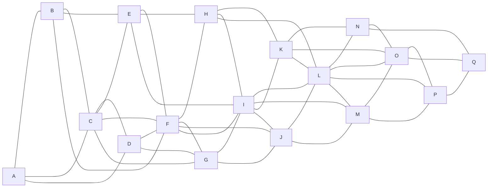

<!-- _class: lead -->

# Grafos - segunda parte #

- Professor: Carlos Alvaro Quintella
- Revisão: 10/05/2023

---

## Representação de Grafos ##

Existem várias maneiras de representar um grafo. Uma representação simples é dada por uma lista de adjacências, que especifica todos os vértices adjacentes a cada vértice do grafo.

```text
  1-----2
  |     |
  |     |
  4-----3
```

```text
1: 2, 4
2: 1, 3
3: 2, 4
4: 1, 3
```

---

Cada linha aqui representa um vértice no grafo e a lista de vértices com os quais ele compartilha uma aresta. Por exemplo, o vértice 1 tem uma aresta para os vértices 2 e 4, portanto, a linha correspondente na lista de adjacências é "1: 2, 4".

---

## Exercício ##

Represente as pontes de Kronisberg como um grafo de adjacência.

---

No jogo estavaos desenvolvendo n curso de algoritmos o seguinte grafo pode representar a movimentação possível dos jogfadores no campo de futebol.

```text
        B  E  H  K  N 
        
(GOL) A C  F (I) L  O  Q (GOL)
       
        D  G  J  M  P




[Mermaid editor](https://mermaid.live/)

---

### Matriz de Adjacência ###

Matriz de Adjacências: Uma matriz de adjacências é uma matriz quadrada de tamanho NxN, onde N é o número de vértices no grafo. A entrada M[i][j] é 1 se existe uma aresta entre o vértice "i" e o vértice "j", e 0 caso contrário. Para grafos não direcionados, a matriz é simétrica em relação à diagonal principal.

Exemplo para o grafo A - B - C - D:

```text
  A B C D
A 0 1 0 0
B 1 0 1 0
C 0 1 0 1
D 0 0 1 0
```

Matriz de Incidência: Uma matriz de incidência é uma matriz de tamanho NxM, onde N é o número de vértices e M é o número de arestas. A entrada M[i][j] é 1 se a aresta "j" é incidente ao vértice "i", e 0 caso contrário. Para um grafo não direcionado, cada coluna da matriz terá exatamente dois 1s.

Exemplo para o grafo A - B - C - D com as arestas AB, BC e CD:

---

### Lista de adjacencia ###

Uma lista de adjacências é uma maneira de representar um grafo em que, para cada vértice do grafo, mantemos uma lista dos vértices aos quais ele está conectado por uma aresta. Essa representação é especialmente útil quando temos um grafo esparso (um grafo com poucas arestas em comparação ao número total possível de arestas), pois economiza espaço de armazenamento.

---

Por exemplo, para um grafo não direcionado com os vértices A, B, C, D e as arestas (A-B), (B-C), (C-D), a lista de adjacências seria a seguinte:

```text
A: B
B: A, C
C: B, D
D: C

```
---

Para representar um grafo com pesos e direcionado, você pode utilizar a representação de Lista de Adjacência com pesos nas arestas. Nesse formato, cada linha do arquivo representa um nó do grafo, e os nós adjacentes são listados com seus respectivos pesos.

```text
1: (2, 3.0), (3, 5.2)
2: (1, 2.1), (3, 4.4)
3: (1, 1.5), (2, 6.1)
```

---

## Exercício 2 ##

Represente as pontes de Kronisberg como um grafo de adjacência.

---

Cada linha representa um vértice e os vértices aos quais ele está conectado. Por exemplo, o vértice B está conectado aos vértices A e C, portanto, a linha correspondente na lista de adjacências é "B: A, C".

Em uma lista de adjacências para um grafo direcionado, a presença de um vértice em outra lista de vértices significa que existe uma aresta na direção do primeiro vértice para o segundo.

---

## Travessia de Grafos ##

O processo de travessia envolve "visitar" cada elemento do grafo. Isso é fácil de se fazer com uma lista encadeada, pois cada elemento está ligado ao seguinte em ordem. No entanto, em um grafo, isso não ocorre, já que um grafo pode ter elementos isolados e ligações formando círculos.

---

Nós utilizamos um algoritmo conhecido como algoritmo de busca em profundidade (depth-first search), que foi desenvolvido por John Hopcroft e Robert Tarjan.

Neste algoritmo, cada vértice v é visitado e, em seguida, cada vértice adjacente a v não visitado também é visitado. Se um vértice v não tem vértices adjacentes ou se todos os seus vértices adjacentes já foram visitados, nós voltamos ao predecessor de v. A travessia é concluída se este processo de visitação e retorno levar ao primeiro vértice onde a travessia começou. Se ainda houver alguns vértices não visitados no grafo, a travessia continua reiniciando a partir de um dos vértices não visitados.

---

Observe que este algoritmo garante a geração de uma árvore (ou uma floresta, um conjunto de árvores) que inclui ou se estende por todos os vértices do grafo original. Uma árvore que cumpre essa condição é chamada de árvore de extensão (spanning tree).

---

Exemplo de implementação em C para matriz de adjacência:

```c

#include <stdio.h>

#define MAX_VERTICES 5
int visited[MAX_VERTICES];

void DFS(int graph[MAX_VERTICES][MAX_VERTICES], int start_vertex) {
    visited[start_vertex] = 1;
    printf("%d ", start_vertex);

    for (int i = 0; i < MAX_VERTICES; i++) {
        if (graph[start_vertex][i] == 1 && visited[i] == 0) {
            DFS(graph, i);
        }
    }
}

int main() {
    int graph[MAX_VERTICES][MAX_VERTICES] = {
        {0, 1, 0, 0, 1},
        {1, 0, 1, 1, 1},
        {0, 1, 0, 0, 0},
        {0, 1, 0, 0, 1},
        {1, 1, 0, 1, 0},
    };
  
    for (int i = 0; i < MAX_VERTICES; i++) {
        visited[i] = 0;
    }

    DFS(graph, 0);

    return 0;
}
```
