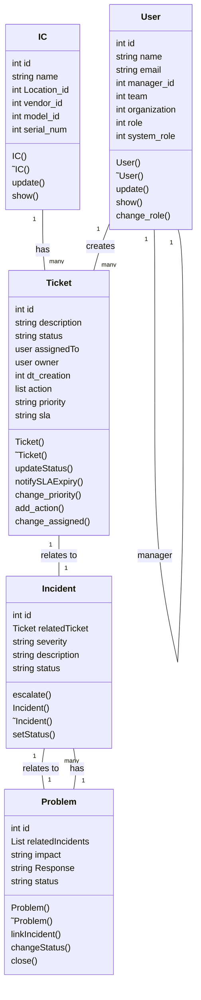

# Class Diagram #

```mermaid

classDiagram
    class IC{
         int id
         string name
         int Location_id
         int vendor_id
         int model_id
         int serial_num
         IC()
         ˜IC()
         update()
         show()
    }
    class User{
         int id
         string name
         string email
         int manager_id
         int team
         int organization
         int role
         int system_role
         User()
         ˜User()
         update()
         show()
         change_role()
    }
    class Ticket{
         int id
         string description
         string status
         user assignedTo
         user owner
         int dt_creation
         list<string> action
         string priority
         string sla
         Ticket()
         ˜Ticket()
         updateStatus()
         notifySLAExpiry()
         change_priority()
         add_action()
         change_assigned()
    }
    class Incident{
         int id
         Ticket relatedTicket
         string severity
         string description
         string status
         escalate()
         Incident()
         ˜Incident()
         setStatus()
    }
    class Problem{
         int id
         List<Incident> relatedIncidents
         string impact
         string Response
         string status
         Problem()
         ˜Problem()
         linkIncident()
         changeStatus()
         close()
         

    }
    IC "1" -- "many" Ticket : has
    User "1" -- "many" Ticket : creates
    Ticket "1" -- "1" Incident : relates to
    Incident "1" -- "1" Problem : relates to
    Problem "1" -- "many" Incident : has
    User "1" -- "1" User : manager
```
